<div align="center">

# 📡 UDP Bandwidth Tester

**Measure UDP throughput, packet loss, jitter and data integrity between two machines.**
**Qt GUI and command-line tool, with framed packets (`FE FA … 33`) you can inspect byte by byte.**


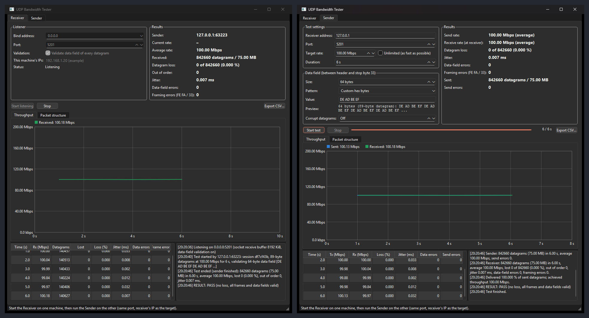

</div>

---

## Contents

- [Features](#-features)
- [Quick start](#-quick-start)
- [How to use the GUI, step by step](#%EF%B8%8F-how-to-use-the-gui-step-by-step)
- [How to use the command line](#%EF%B8%8F-how-to-use-the-command-line)
- [How it works](#%EF%B8%8F-how-it-works)
- [What the numbers mean](#-what-the-numbers-mean)
- [Building from source](#%EF%B8%8F-building-from-source)
- [Troubleshooting](#-troubleshooting)
- [Project layout and documentation](#-project-layout-and-documentation)

---

## ✨ Features

| | |
|---|---|
| 🚀 **Bandwidth** | Paced sending at any rate from 10 kbps to 100 Gbps (token bucket), or unlimited. Live per-second throughput on both ends |
| 📉 **Loss and order** | Per-datagram sequence numbers give exact loss, including at the very end of a test, and out-of-order counts |
| ⏱️ **Jitter** | RFC 3550 interarrival jitter; the two machines don't need synchronised clocks |
| 🧱 **Framing** | Every datagram is `FE FA` · header · data · `33`. Bad frames are counted and logged |
| 🔍 **Data validation** | Choose the data field (size 1 to 65466 bytes; incrementing, fixed, random, hex or text pattern). The receiver checks every byte of every datagram |
| 💥 **Error injection** | Corrupt 1 in N datagrams on purpose to prove the validation works |
| 🧬 **Packet structure view** | Ethernet / IPv4 / UDP / frame layers, every field decoded, colour-coded hex dump, bytes on the wire |
| ✅ **Verdict** | PASS/FAIL per test; CSV export; scriptable CLI with exit codes |
| 🧩 **Clean architecture** | UDP engine (`src/core`) fully independent of the GUI; GUI and CLI are thin front ends |

---

## ⚡ Quick start

1. **Download** `UdpBandwidthTester_win64.zip` from the [**Releases**](../../releases) page and unzip it on **both** PCs.
   No installation is needed; Qt and the Visual C++ runtime are included.
2. On the **receiving PC**, run `allow_firewall_port_5201.bat` once as Administrator. This
   lets the test traffic in.
3. **Receiving PC:** open `UdpBandwidthTester.exe` → **Receiver** tab → **Start listening**.
4. **Sending PC:** open `UdpBandwidthTester.exe` → **Sender** tab → enter the receiver's IP →
   **Start test**.

> 💡 To try it on one PC, run two copies of the app and use `127.0.0.1` as the receiver address.

---

## 🖱️ How to use the GUI, step by step

### Step 1: Start the receiver

On the PC that will **receive**, open the **Receiver** tab and click **Start listening**.
Keep the bind address `0.0.0.0` (all network interfaces) and port `5201`. The tab lists
this PC's IP addresses; give one of them to the sender.

<p align="center">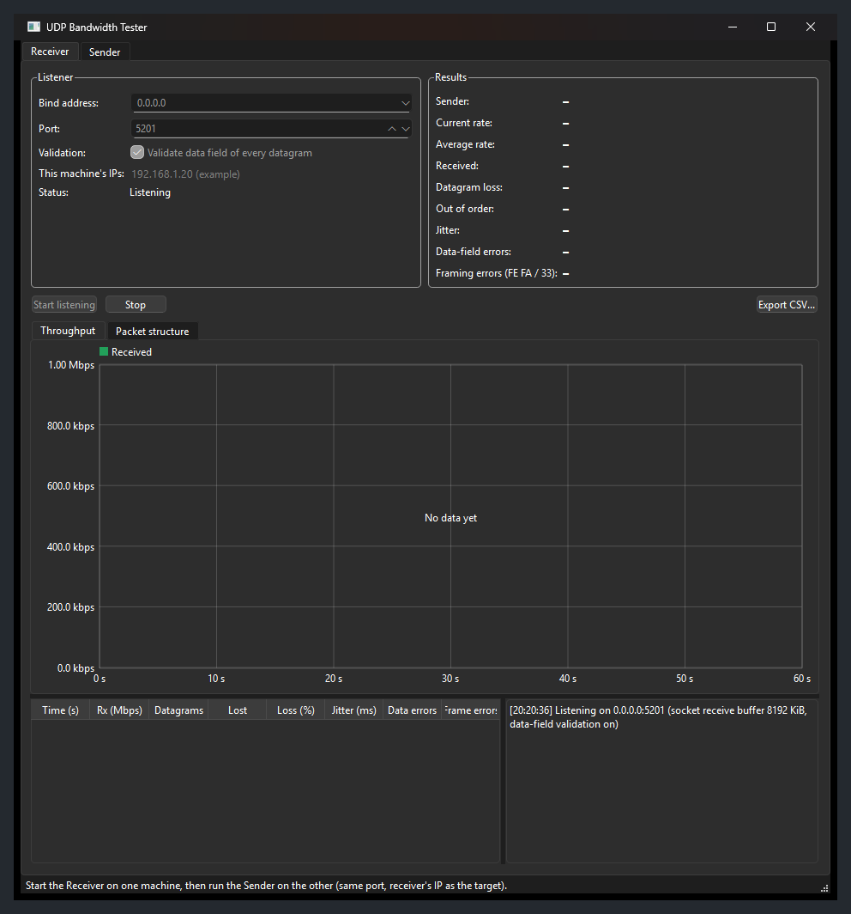</p>

### Step 2: Configure the sender

On the **sending** PC, open the **Sender** tab:

| Setting | What to enter |
|---|---|
| **Receiver address** | The receiver's IP (or host name) |
| **Port** | Same as the receiver (default `5201`) |
| **Target rate** | Rate to send at, in Mbps, or tick **Unlimited** |
| **Duration** | Test length in seconds |
| **Data field: Size** | Data bytes per datagram (1 to 65466). Each datagram adds 25 bytes (`FE FA` + header + `33`) |
| **Data field: Pattern / Value** | What the data bytes contain (see the table below) |
| **Corrupt datagrams** | `Off`, or `1 in N` to deliberately damage every Nth datagram |

The **Preview** line and the **Packet structure** tab update as you type, showing exactly
what will be sent:

<p align="center">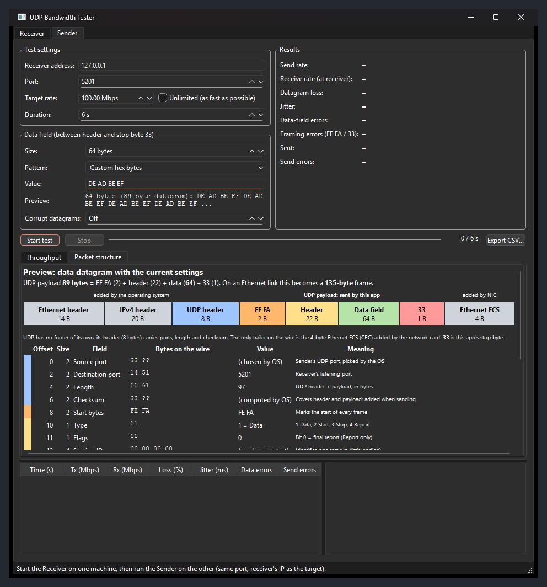</p>

| Pattern | Value | Data field example |
|---|---|---|
| Incrementing bytes | first byte in hex (optional) | `00 01 02 03 …` |
| Fixed byte | one byte in hex | `A5 A5 A5 …` |
| Pseudo-random | seed (optional) | xorshift32 sequence |
| Custom hex bytes | `DE AD BE EF`, `0xDE,0xAD`, `DEADBEEF` | repeated to fill the field |
| Text | `HELLO` | UTF-8, repeated to fill the field |

Invalid input is caught immediately. The reason is shown in red, and **Start test** stays
disabled until you fix it:

<p align="center">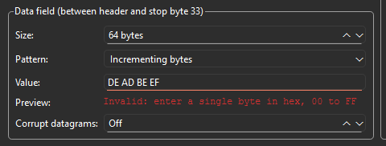</p>

### Step 3: Run the test

Click **Start test**. Both windows plot throughput every second. The sender also shows
what the receiver actually got, because the receiver reports back once per second.

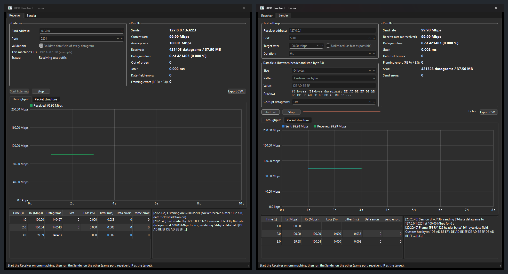

### Step 4: Read the results

When the test ends, both logs print a summary and a verdict. **PASS** means no loss, no
framing errors and no data-field errors. **Export CSV…** saves the per-second table.


### Step 5: Inspect the packets

Open the **Packet structure** tab to see the first datagram of the test, as sent (left: the
receiver's copy; right: the sender's):

- 🟦 **UDP header** (8 B), 🟧 **`FE FA`**, 🟨 **header** (22 B), 🟩 **data field**, 🟥 **`33`**,
  plus the Ethernet/IPv4 layers and FCS added by the OS and network card;
- every field decoded: ports, length, session, sequence number, timestamp;
- a colour-coded hex dump, and how many bytes one datagram occupies on the link.

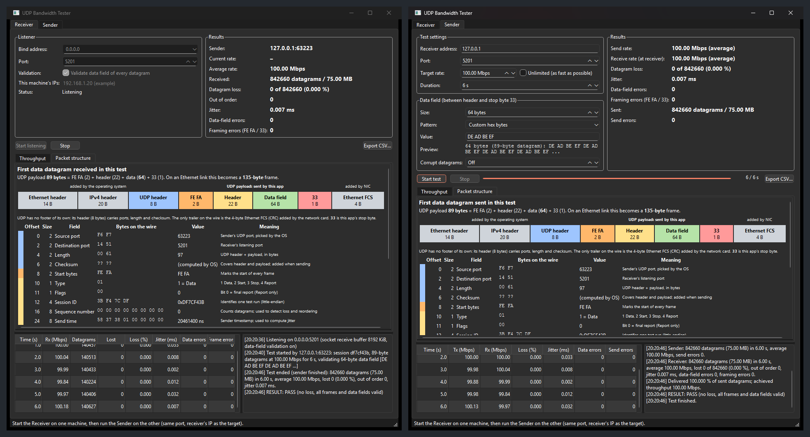

### Step 6: Verify error detection (optional)

Set **Corrupt datagrams** to `1 in 1000` and run again. The receiver logs each damaged
datagram (datagram number, offset, expected and actual byte), and the test ends with
**FAIL**. Here 561 datagrams were corrupted, and 561 data-field errors were detected:

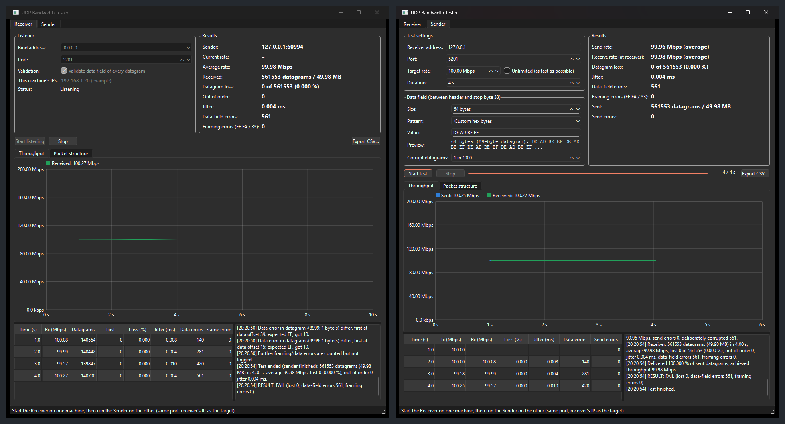

---

## ⌨️ How to use the command line

`udpbw-cli.exe` uses the same engine and protocol as the GUI, so they can test each other.

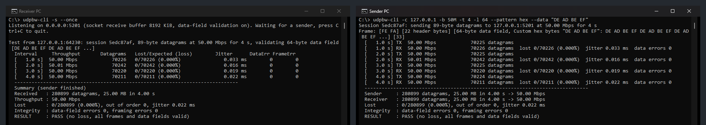

```bat
:: Receiving PC
udpbw-cli -s                                     :: listen on port 5201 until Ctrl+C
udpbw-cli -s --once --csv rx.csv                 :: one test, then exit; save per-second CSV

:: Sending PC
udpbw-cli -c 192.168.1.20 -b 500M -t 10          :: 500 Mbps for 10 s
udpbw-cli -c 192.168.1.20 -b max -l 8947         :: unlimited rate, jumbo-frame datagrams
udpbw-cli -c 192.168.1.20 -b 2M -l 10 --show-frame              :: 10 data bytes; print packet layout
udpbw-cli -c 192.168.1.20 --pattern hex --data "DE AD BE EF"    :: custom data field
udpbw-cli -c 192.168.1.20 --pattern fixed --data A5 --corrupt 1000  :: test the validation
```

| Option | Mode | Meaning |
|---|---|---|
| `-s`, `--server` | receiver | Run as receiver |
| `-c`, `--client <host>` | sender | Run as sender towards `host` |
| `-p`, `--port <n>` | both | UDP port (default `5201`) |
| `-B`, `--bind <addr>` | receiver | Local address to listen on (default `0.0.0.0`) |
| `--once` | receiver | Exit after the first test |
| `--no-validate` | receiver | Skip data-field checks (framing is always checked) |
| `-b`, `--bandwidth <rate>` | sender | `500k`, `100M`, `1.5G`; a bare number means Mbps; `0`/`max` = unlimited (default `100M`) |
| `-t`, `--time <s>` | sender | Duration (default `10`) |
| `-l`, `--length <bytes>` | sender | Data-field size, 1 to 65466 (default `1447`) |
| `--pattern <name>` | sender | `inc`, `fixed`, `random`, `hex`, `text` (default `inc`) |
| `--data <value>` | sender | Pattern value: byte, seed, hex bytes or text |
| `--corrupt <N>` | sender | Corrupt one data-field byte in every Nth datagram |
| `--show-frame` | both | Print the structure and hex dump of the first data datagram |
| `--csv <file>` | both | Write per-second results to a CSV file |

**Exit codes:** `0` PASS · `1` error (bad input, socket) · `2` no final report from the
receiver · `3` FAIL (loss, framing or data-field errors).

---

## ⚙️ How it works

### Architecture

The UDP engine lives in `src/core` and has no GUI dependency. The GUI and the CLI are thin
front ends that only call `UdpSender` / `UdpReceiver` and react to their signals.

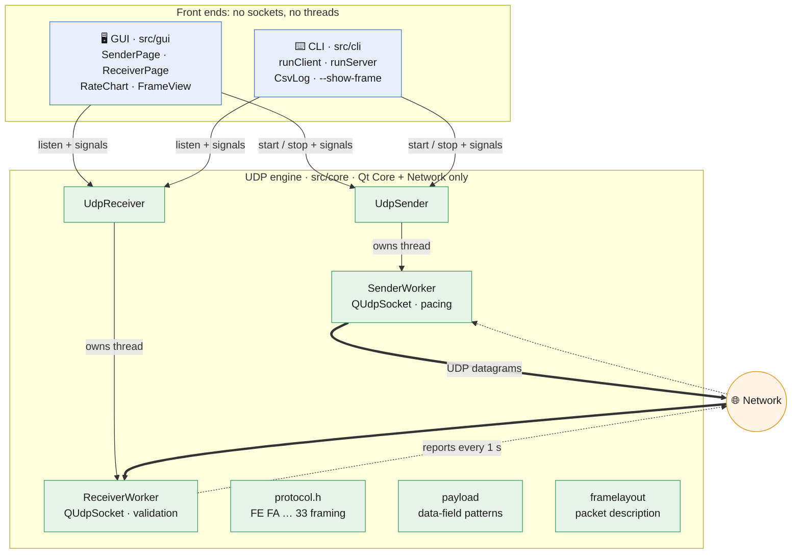

### Datagram format

Every datagram, in both directions, is framed with **`FE FA`** at the start and **`33`** at
the end:

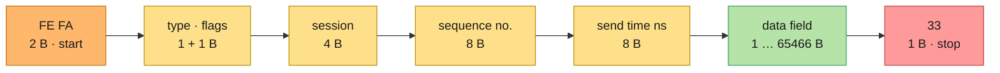

On the wire, the OS adds a UDP header (8 B), an IPv4 header (20 B) and an Ethernet header
(14 B), and the network card adds the Ethernet FCS (4 B). UDP has no footer; `33` is this
app's own stop byte.

### One test, end to end

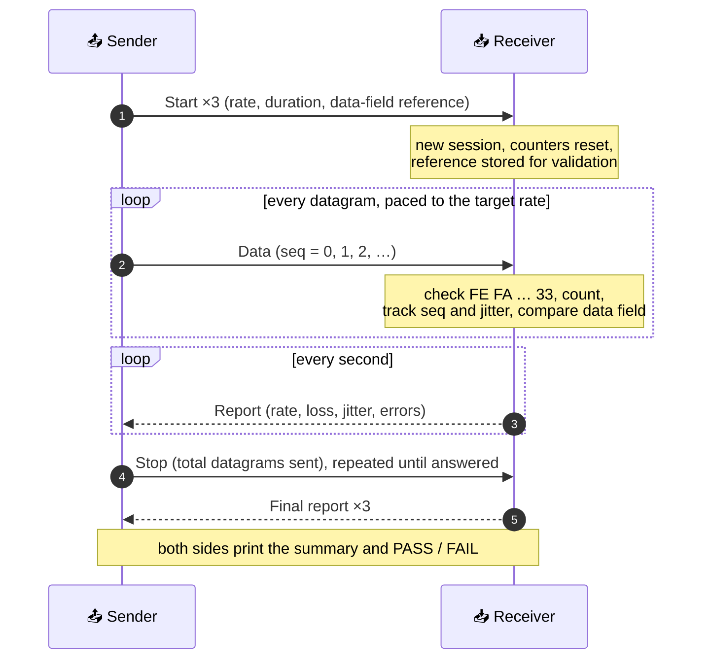

---

## 📊 What the numbers mean

| Metric | Definition |
|---|---|
| **Throughput** | UDP payload bits per second (`FE FA … 33`). IP/UDP/Ethernet headers aren't counted |
| **Loss** | `expected − received`, where expected = highest sequence number + 1, or the total announced in Stop |
| **Out of order** | Datagrams that arrived after one with a higher sequence number |
| **Jitter** | RFC 3550: running average of the variation in transit time |
| **Framing errors** | Datagrams not starting with `FE FA` or not ending with `33` |
| **Data-field errors** | Datagrams whose data field differs from the reference sent in Start |
| **Efficiency** | Data bytes ÷ bytes on the link (see the Packet structure tab). Small datagrams are mostly headers |

---

## 🛠️ Building from source

Requires **Qt 6** (or Qt 5.15+) with *Widgets* and *Network*, a **C++17** compiler and
**CMake 3.16+**.

```bat
:: Windows: from an "x64 Native Tools Command Prompt for VS 2022"
cmake -S . -B build -G "NMake Makefiles" -DCMAKE_BUILD_TYPE=Release -DCMAKE_PREFIX_PATH=C:/Qt/6.8.3/msvc2022_64
cmake --build build
C:\Qt\6.8.3\msvc2022_64\bin\windeployqt.exe --release build\UdpBandwidthTester.exe build\udpbw-cli.exe
```

```bash
# Linux
cmake -S . -B build -DCMAKE_BUILD_TYPE=Release && cmake --build build -j
```

This builds three targets: `udpbw_core` (static library), `UdpBandwidthTester` (GUI) and
`udpbw-cli` (CLI). There are also qmake projects (`UdpBandwidthTester.pro`,
`udpbw-cli.pro`) for Qt Creator.

---

## 🩺 Troubleshooting

| Symptom | Cause / fix |
|---|---|
| *"No final report from the receiver"* | The receiver isn't listening, or a firewall blocks UDP. Run `allow_firewall_port_5201.bat` on the receiver; check the IP and port |
| Loss appears at high rates | The link or the receiving PC is saturated. Lower the rate, or use bigger datagrams |
| Rate far below target with small datagrams | Each PC can send only so many packets per second (~150–250k). Use a larger data field |
| Framing errors | Something else is sending to the port, or a device on the path alters datagrams |
| Data-field errors without error injection | Corruption on the path; the log shows which byte changed and how |

---

## 📚 Project layout and documentation

```
src/core/   UDP engine: framing, sending, receiving, validation, statistics (no GUI)
src/gui/    Qt Widgets front end
src/cli/    Command-line front end
docs/       Documentation and screenshots
```

| Document | Contents |
|---|---|
| [**docs/API_REFERENCE.md**](docs/API_REFERENCE.md) | Every class and function: parameters, return values, what it does, how to use it, with flow charts |
| [**docs/SOURCE_GUIDE.md**](docs/SOURCE_GUIDE.md) | How transmission, reception and monitoring work internally: algorithms, formulas, threading |

Using the engine in your own code takes a few lines:

```cpp
UdpSender sender;
QObject::connect(&sender, &UdpSender::remoteStats, [](const RxStats &s) {
    qDebug() << s.intervalMbps() << "Mbps, lost" << s.totalLost;
});
SenderConfig cfg;
cfg.target = resolveHost("192.168.1.20");
Payload::build({PayloadPattern::FixedByte, "A5"}, 10, cfg.payload);   // 10 data bytes of A5
cfg.packetSize = Proto::packetSizeFor(10);
sender.start(cfg);
```
