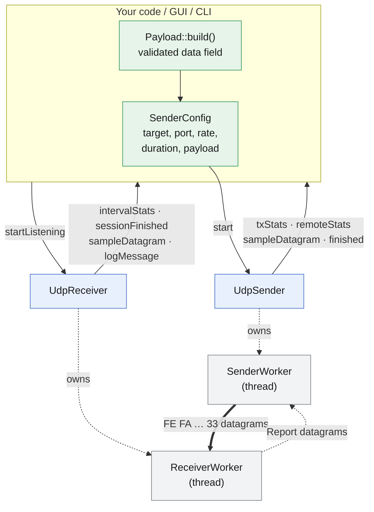
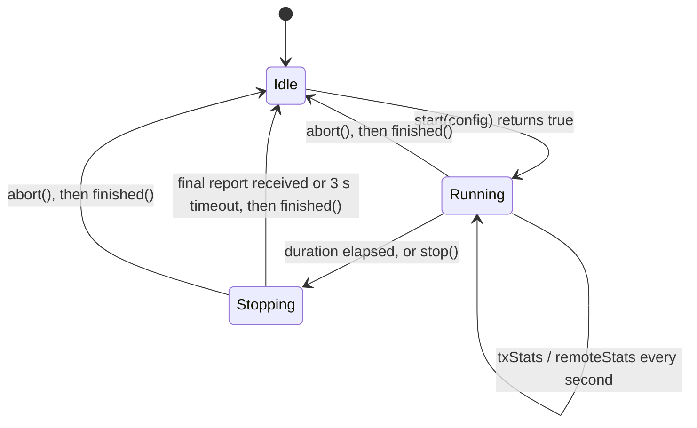
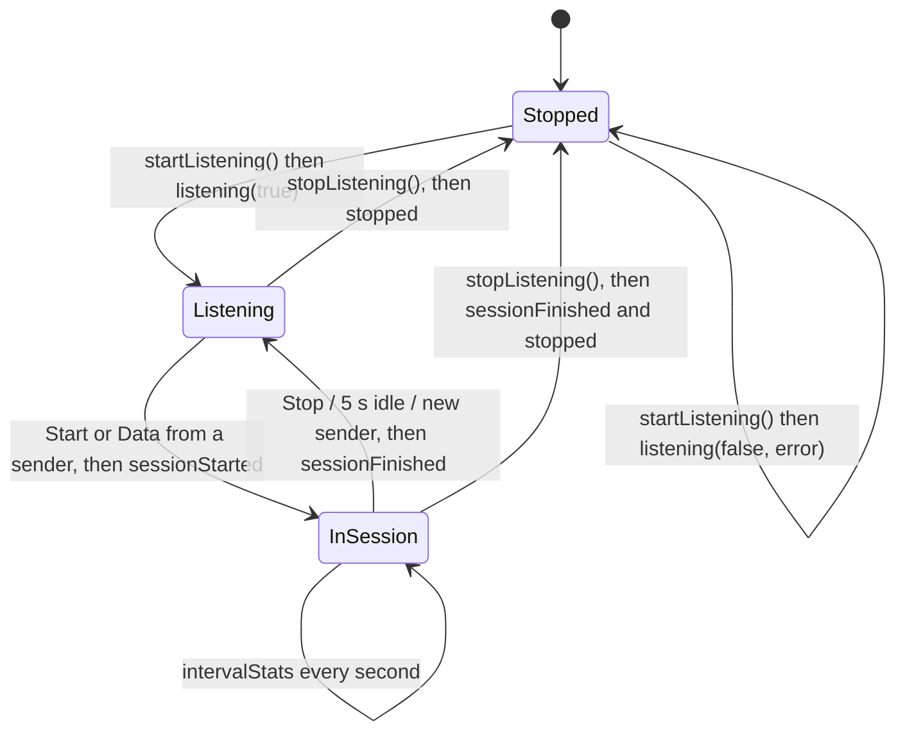
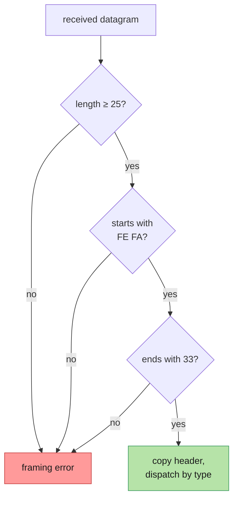
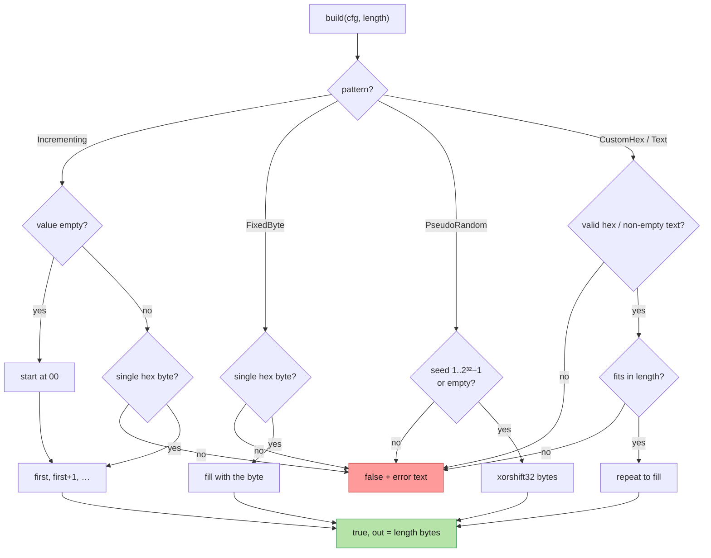
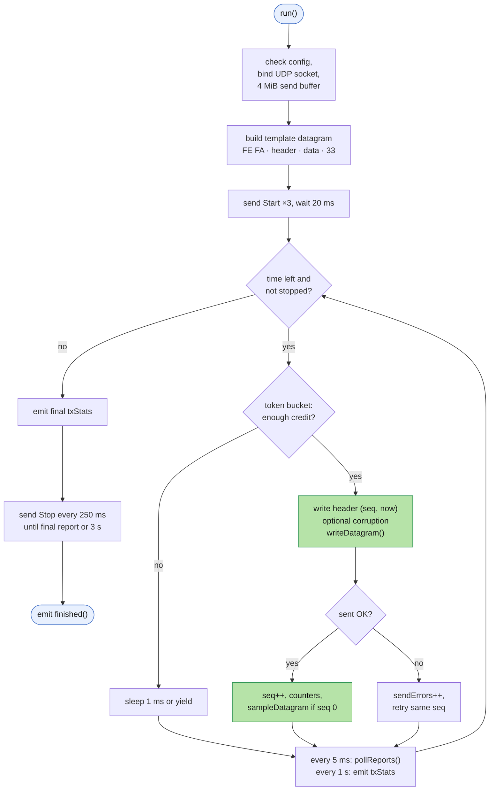
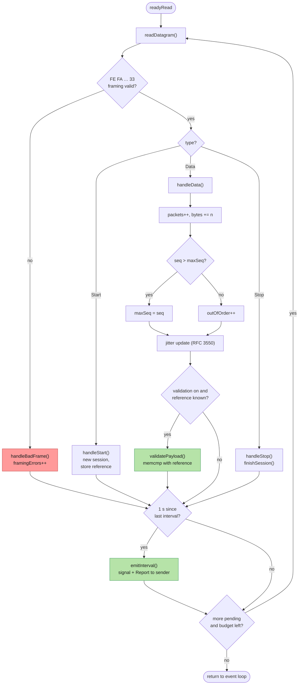

# 📖 API Reference

Every class, function and signal in the UDP Bandwidth Tester, with its parameters, return
value, what it does and how to use it.

> **Where to start:** to send or receive UDP from your own code, you only need
> [`UdpSender`](#udpsender) and [`UdpReceiver`](#udpreceiver), plus
> [`Payload::build`](#payloadbuild) to make a data field. Everything else is either a
> helper or internal.

## Contents

| Area | Header | Contents |
|---|---|---|
| **Public engine API** | `udpsender.h`, `udpreceiver.h` | [UdpSender](#udpsender) · [SenderConfig](#senderconfig) · [UdpReceiver](#udpreceiver) |
| **Statistics** | `protocol.h` | [TxStats](#txstats) · [RxStats](#rxstats) |
| **Wire protocol** | `protocol.h` | [Constants](#protocol-constants) · [Structs](#protocol-structs) · [Functions](#protocol-functions) |
| **Data field** | `payload.h` | [PayloadPattern / PayloadConfig](#payloadpattern-and-payloadconfig) · [Functions](#payload-functions) |
| **Packet description** | `framelayout.h` | [Types](#frame-types) · [Functions](#frame-functions) |
| **Helpers** | `netutil.h`, `format.h` | [Network helpers](#network-helpers) · [Formatting](#formatting) |
| **Internals** | `senderworker.h`, `receiverworker.h` | [SenderWorker](#senderworker-internal) · [ReceiverWorker](#receiverworker-internal) |
| **Front ends** | `src/gui`, `src/cli` | [GUI functions](#gui-functions) · [CLI functions](#cli-functions) |

---

## How the pieces fit together



All signals are delivered in the thread that owns the `UdpSender` / `UdpReceiver` object
(usually the GUI or `main()` thread), so your slots never run concurrently with each other.

---

# Public engine API

## UdpSender

`#include "udpsender.h"` · inherits `QObject`

Runs **one sender test at a time** in a background thread. You give it a `SenderConfig`
and it announces the session, sends paced datagrams, collects the receiver's reports, and
emits statistics as signals.

### Lifecycle



### `UdpSender(QObject *parent = nullptr)`

Creates an idle sender.

| Parameter | Type | Description |
|---|---|---|
| `parent` | `QObject*` | Optional Qt parent; the sender is deleted with it |

### `~UdpSender()`

Aborts a running test (without waiting for the receiver's report) and waits for the
worker thread to end. Safe to destroy at any time.

### `bool isRunning() const`

**Returns** `true` while a test is in progress, from `start()` until `finished()`.

### `bool start(const SenderConfig &config)`

Starts a test in a new background thread and returns immediately.

| Parameter | Type | Description |
|---|---|---|
| `config` | [`SenderConfig`](#senderconfig) | Target, rate, duration and data field. `config.payload` must be exactly `Proto::payloadSize(config.packetSize)` bytes |

**Returns** `false` if a test is already running (nothing changes); otherwise `true`.
Problems found while running (bad config, socket errors) are reported through
`logMessage` and end with `finished()`.

### `void stop()`

Ends the data phase early. The sender still sends `Stop` and waits up to 3 s for the
receiver's final report, so `remoteStats(final)` normally still arrives. Does nothing
when idle.

### `void abort()`

Ends the test as soon as possible, **without** waiting for the final report. Does
nothing when idle.

### Signals

| Signal | Parameters | When |
|---|---|---|
| `logMessage(const QString &text)` | `text`: human-readable line | Session start, frame description, send errors, missing final report |
| `txStats(const TxStats &stats)` | [`TxStats`](#txstats) | Every second, then once with `stats.final == true` when the data phase ends |
| `remoteStats(const RxStats &stats)` | [`RxStats`](#rxstats) | Every receiver report (≈1/s), last one with `stats.final == true` |
| `sampleDatagram(const QByteArray &datagram, quint16 localPort)` | `datagram`: the first data datagram exactly as sent (`FE FA … 33`); `localPort`: sender's UDP source port | Once, right after the first datagram is sent |
| `finished()` | — | The test is over and the thread has ended; `start()` may be called again |

### Example

```cpp
UdpSender sender;
QObject::connect(&sender, &UdpSender::txStats, [](const TxStats &s) {
    if (!s.final) qDebug() << "sent" << s.intervalMbps() << "Mbps";
});
QObject::connect(&sender, &UdpSender::remoteStats, [](const RxStats &s) {
    if (s.final) qDebug() << "receiver got" << s.totalPackets << "lost" << s.totalLost;
});
QObject::connect(&sender, &UdpSender::finished, qApp, &QCoreApplication::quit);

SenderConfig cfg;
cfg.target = resolveHost("192.168.1.20");
cfg.rateMbps = 200;
cfg.durationSec = 5;
Payload::build({PayloadPattern::Incrementing, ""}, 1447, cfg.payload);
cfg.packetSize = Proto::packetSizeFor(1447);
sender.start(cfg);
```

---

## SenderConfig

`#include "senderworker.h"` (included by `udpsender.h`), plain struct.

| Field | Type | Default | Description |
|---|---|---|---|
| `target` | `QHostAddress` | — | Receiver address (IPv4 or IPv6). Use [`resolveHost()`](#qhostaddress-resolvehostconst-qstring-host) for names |
| `port` | `quint16` | `5201` | Receiver UDP port |
| `packetSize` | `int` | 1472 | **Whole** datagram size in bytes, `FE FA` and `33` included. Use `Proto::packetSizeFor(dataSize)` |
| `rateMbps` | `double` | `100.0` | Target rate in Mbit/s (UDP payload); ignored when `unlimited` |
| `unlimited` | `bool` | `false` | `true` = send as fast as possible |
| `durationSec` | `int` | `10` | Length of the data phase in seconds |
| `payload` | `QByteArray` | — | The data field: exactly `packetSize − 25` bytes. Build it with [`Payload::build()`](#payloadbuild) |
| `payloadDescription` | `QString` | — | Free text for the log, e.g. `Fixed byte "A5"` |
| `corruptEvery` | `int` | `0` | Error injection: corrupt one data-field byte in every Nth datagram (`0` = off) |

---

## UdpReceiver

`#include "udpreceiver.h"` · inherits `QObject`

Listens for test traffic in a background thread for its whole lifetime. It handles any
number of consecutive tests (sessions), validates every datagram, and reports statistics
both to you (signals) and back to the sender (Report datagrams).

### Lifecycle



### `UdpReceiver(QObject *parent = nullptr)`

Creates the receiver and starts its worker thread. No socket is opened yet.

| Parameter | Type | Description |
|---|---|---|
| `parent` | `QObject*` | Optional Qt parent |

### `~UdpReceiver()`

Calls `shutdown()`.

### `void startListening(const QString &bindAddress, quint16 port, bool validatePayload)`

Opens the UDP socket (asynchronously); the result arrives through `listening(ok, message)`.
Calling it again re-opens the socket with the new settings.

| Parameter | Type | Description |
|---|---|---|
| `bindAddress` | `QString` | Local address, e.g. `"0.0.0.0"` (all IPv4 interfaces) or one interface's IP |
| `port` | `quint16` | UDP port to listen on |
| `validatePayload` | `bool` | `true` = compare every datagram's data field with the reference from the sender's Start datagram. Framing (`FE FA … 33`) is always checked |

### `void stopListening()`

Closes the socket asynchronously. A running test is finished first (final report sent,
`sessionFinished` emitted), then `stopped()` is emitted.

### `void shutdown()`

Synchronous version for application exit: closes the socket and ends the worker thread
before returning. Signals produced while closing are still queued for your thread; call
`QCoreApplication::processEvents()` afterwards if you need them. Safe to call more than
once.

### Signals

| Signal | Parameters | When |
|---|---|---|
| `listening(bool ok, const QString &message)` | `ok`: socket opened; `message`: details or the error | After `startListening()` |
| `stopped()` | — | After the socket is closed |
| `sessionStarted(const QString &peer, const QString &details)` | `peer`: sender `ip:port`; `details`: session ID, datagram size, rate, duration, validation status | A sender starts a test |
| `intervalStats(const RxStats &stats)` | [`RxStats`](#rxstats) with interval fields filled | Every second during a session |
| `sessionFinished(const RxStats &stats, const QString &reason)` | `stats`: totals (`final == true`); `reason`: `"sender finished"`, `"timed out…"`, `"listener stopped"`, `"superseded by a new session"` | A test ends |
| `logMessage(const QString &text)` | `text` | Each framing/data-field error (first 10 per session) |
| `sampleDatagram(const QByteArray &datagram, quint16 srcPort, quint16 dstPort)` | first data datagram of the session; sender's port; local port | Once per session |

### Example

```cpp
UdpReceiver receiver;
QObject::connect(&receiver, &UdpReceiver::intervalStats, [](const RxStats &s) {
    qDebug() << s.intervalMbps() << "Mbps," << s.intervalLossPct() << "% loss";
});
QObject::connect(&receiver, &UdpReceiver::sessionFinished, [](const RxStats &s, const QString &why) {
    qDebug() << "test ended:" << why << "data errors:" << s.payloadErrors;
});
receiver.startListening("0.0.0.0", 5201, true);
```

---

# Statistics

## TxStats

Sender statistics for one interval, or for the whole data phase when `final == true`.

| Field / method | Type | Description |
|---|---|---|
| `final` | `bool` | `true` for the end-of-test summary |
| `elapsedSec` | `double` | Seconds since the first data datagram |
| `intervalSec` | `double` | Length of this interval (≈1 s; 0 in the summary) |
| `intervalPackets`, `intervalBytes` | `quint64` | Sent in this interval |
| `totalPackets`, `totalBytes` | `quint64` | Sent since the start |
| `sendErrors` | `quint64` | Failed `writeDatagram` calls |
| `corruptedPackets` | `quint64` | Datagrams deliberately corrupted (error injection) |
| `intervalMbps() const` | `double` | `intervalBytes × 8 / intervalSec / 10⁶` |
| `avgMbps() const` | `double` | `totalBytes × 8 / elapsedSec / 10⁶` |

## RxStats

Receiver statistics. The same struct is used locally (`intervalStats`, `sessionFinished`)
and is sent to the sender in Report datagrams (`remoteStats`).

| Field / method | Type | Description |
|---|---|---|
| `session` | `quint32` | Session ID of the test |
| `final` | `bool` | `true` for the end-of-test summary |
| `elapsedSec` | `double` | Since the first data datagram (to the last datagram in the summary) |
| `totalPackets`, `totalBytes` | `quint64` | Valid data datagrams received |
| `totalLost` | `quint64` | `max(0, expected − received)` |
| `outOfOrder` | `quint64` | Datagrams that arrived after a higher sequence number |
| `framingErrors` | `quint64` | Datagrams without `FE FA … 33` |
| `payloadErrors` | `quint64` | Datagrams whose data field didn't match the reference |
| `jitterMs` | `double` | RFC 3550 interarrival jitter, in ms |
| `intervalSec`, `intervalPackets`, `intervalBytes` | | This interval |
| `intervalLost` | `qint64` | Lost in this interval; **can be negative** when late datagrams fill earlier gaps |
| `intervalMbps() const` | `double` | Receive rate in this interval |
| `avgMbps() const` | `double` | Average receive rate |
| `totalLossPct() const` | `double` | `totalLost / (totalPackets + totalLost) × 100` |
| `intervalLossPct() const` | `double` | Same for the interval (negative loss counted as 0) |

---

# Wire protocol

`#include "protocol.h"` · namespace `Proto`

## Protocol constants

| Constant | Value | Meaning |
|---|---|---|
| `kStartByte0`, `kStartByte1` | `0xFE`, `0xFA` | Start bytes of every datagram |
| `kStopByte` | `0x33` | Last byte of every datagram |
| `kHeaderSize` | 24 | `FE FA` + type + flags + session + seq + sendNs |
| `kTrailerSize` | 1 | The stop byte |
| `kFramingOverhead` | 25 | Bytes around the data field |
| `kStartBodySize` | 16 | Size of `StartBody` |
| `kReportSize` | 121 | Size of a Report datagram |
| `kStopSize` | 25 | Size of a Stop datagram |
| `kMinPacketSize`, `kMaxPacketSize` | 26, 65491 | Datagram size limits |
| `kMinDataSize`, `kMaxDataSize` | 1, 65466 | Data-field size limits |
| `kDefaultDataSize` | 1447 | Gives a 1472-byte datagram (fits a 1500-byte MTU) |
| `kDefaultPort` | 5201 | Default UDP port |
| `Type` | `Data=1, Start=2, Stop=3, Report=4` | Datagram types |
| `Flags` | `FinalReport=0x01` | Report flag |

## Protocol structs

All are `#pragma pack(1)` with little-endian fields (`quint32_le`, …), so they can be
copied straight to and from the wire.

| Struct | Size | Fields |
|---|---|---|
| `Header` | 24 | `start[2]`, `type`, `flags`, `session`, `seq`, `sendNs` |
| `StartBody` | 16 | `packetSize`, `rateBps` (0 = unlimited), `durationMs` |
| `ReportBody` | 96 | `totalPackets`, `totalBytes`, `totalLost`, `outOfOrder`, `framingErrors`, `payloadErrors`, `jitterNs`, `elapsedNs`, `intervalPackets`, `intervalBytes`, `intervalLost`, `intervalNs` |

## Protocol functions

### `constexpr int payloadSize(int packetSize)`

**Returns** the number of data-field bytes in a datagram of `packetSize` bytes
(`packetSize − 25`).

### `constexpr int packetSizeFor(int dataSize)`

**Returns** the datagram size needed for a `dataSize`-byte data field (`dataSize + 25`).

```cpp
cfg.packetSize = Proto::packetSizeFor(10);   // 35
```

### `void writeHeader(char *buf, Type type, quint32 session, quint64 seq, qint64 sendNs, quint8 flags = 0)`

Writes the 24-byte header, start bytes included, to the start of `buf`.

| Parameter | Description |
|---|---|
| `buf` | Destination, at least 24 bytes |
| `type` | `Data`, `Start`, `Stop` or `Report` |
| `session` | Session ID |
| `seq` | Sequence number (Data) or total sent (Stop) |
| `sendNs` | Sender timestamp in ns |
| `flags` | `FinalReport` for the last report, else 0 |

### `void writeTrailer(char *buf, qint64 len)`

Writes the stop byte `33` at `buf[len − 1]`.

### `QByteArray buildDatagram(Type type, quint32 session, quint64 seq, qint64 sendNs, const QByteArray &body, quint8 flags = 0)`

Builds a complete datagram: `header + body + 33`. **Every datagram the app sends is built
by this function.**

| Parameter | Description |
|---|---|
| `type`, `session`, `seq`, `sendNs`, `flags` | As for `writeHeader` |
| `body` | Data field (Data), `StartBody` + data-field reference (Start), `ReportBody` (Report), or empty (Stop) |

**Returns** the framed datagram (`body.size() + 25` bytes).

```cpp
QByteArray d = Proto::buildDatagram(Proto::Data, session, 0, 0, QByteArray(10, '\xA5'));
// FE FA 01 00 <session> <seq> <time> A5 A5 A5 A5 A5 A5 A5 A5 A5 A5 33
```

### `bool hasValidFraming(const char *buf, qint64 len)`

**Returns** `true` if the datagram is at least 25 bytes, starts with `FE FA` and ends
with `33`.

### `bool readHeader(const char *buf, qint64 len, Header &h)`

Checks the framing and, if it's valid, copies the header into `h`.

| Parameter | Description |
|---|---|
| `buf`, `len` | Received datagram |
| `h` | Output header |

**Returns** `false` (with `h` untouched) on bad framing.



### `QByteArray encodeReport(const RxStats &s)`

Builds a Report datagram (121 bytes) from receiver statistics; sets `FinalReport` when
`s.final`.

### `bool decodeReport(const char *buf, qint64 len, RxStats &s)`

Parses a Report datagram into `s`. **Returns** `false` if it is not a valid, framed Report.

---

# Data field

`#include "payload.h"` · namespace `Payload`

## PayloadPattern and PayloadConfig

| `PayloadPattern` | `value` meaning | Example result |
|---|---|---|
| `Incrementing` | first byte in hex, optional (default `00`) | `00 01 02 …` |
| `FixedByte` | one byte in hex (required) | `A5 A5 A5 …` |
| `PseudoRandom` | seed 1–4294967295, optional (default 1) | xorshift32 bytes |
| `CustomHex` | hex bytes, repeated to fill | `DE AD BE EF DE AD …` |
| `Text` | text (UTF-8), repeated to fill; spaces are kept | `HELLOHELLO…` |

`struct PayloadConfig { PayloadPattern pattern; QString value; }`. The array
`kAllPayloadPatterns[]` lists every pattern, for menus.

## Payload functions

### `Payload::build`

`bool build(const PayloadConfig &cfg, int length, QByteArray &out, QString *error = nullptr)`

Validates the user's input and produces exactly `length` data-field bytes.

| Parameter | Description |
|---|---|
| `cfg` | Pattern and value as typed by the user |
| `length` | Data-field size in bytes (1 to 65466) |
| `out` | Output: the data field |
| `error` | Optional output: a user-readable reason when the input is invalid |

**Returns** `true` on success.



```cpp
QByteArray data; QString why;
if (!Payload::build({PayloadPattern::CustomHex, "DE AD BE EF"}, 10, data, &why))
    qWarning() << "invalid:" << why;
// data = DE AD BE EF DE AD BE EF DE AD
```

### `bool parseHexBytes(const QString &text, QByteArray &out, QString *error = nullptr)`

Parses hex bytes. Accepted separators are spaces, `,` `;` `:` and `-`; each token may
have a `0x` prefix; long tokens are read two digits at a time (`DEADBEEF`); a 1-digit
token is one byte (`B` → `0B`).

| Parameter | Description |
|---|---|
| `text` | Input text |
| `out` | Output bytes |
| `error` | Optional output: reason on failure |

**Returns** `false` for non-hex characters, odd-length long tokens, or empty input.

### `QString hexPreview(const QByteArray &data, int maxBytes = 24)`

**Returns** the first `maxBytes` bytes as `"DE AD BE EF ..."` (with `...` if truncated).

### `QString patternName(PayloadPattern pattern)`

**Returns** the display name, e.g. `"Fixed byte"`.

### `QString patternKeyword(PayloadPattern pattern)`

**Returns** the CLI keyword: `inc`, `fixed`, `random`, `hex` or `text`.

### `bool patternFromKeyword(const QString &keyword, PayloadPattern &pattern)`

Converts a CLI keyword (case-insensitive) to a pattern. **Returns** `false` if unknown.

### `QString valueHint(PayloadPattern pattern)`

**Returns** help text for the value field, e.g. `"byte value in hex, e.g. A5"`.

---

# Packet description

`#include "framelayout.h"` · namespace `Frame`. Used by the GUI's Packet structure view and
the CLI's `--show-frame`.

## Frame types

| Type | Description |
|---|---|
| `enum class Part` | `UdpHeader`, `StartBytes`, `Header`, `Data`, `StopByte` |
| `struct Field` | `part`, `name`, `offset` (from the start of the UDP header), `size`, `hex` (bytes on the wire), `value` (decoded), `meaning` |
| `struct WireSize` | `dataField`, `udpPayload`, `udpDatagram`, `ipPacket`, `ethernetFrame`, `onWire`, `dataEfficiency` (%) |
| Constants | `kUdpHeaderSize` 8, `kIpv4HeaderSize` 20, `kEthernetHeaderSize` 14, `kEthernetFcsSize` 4, `kPreambleAndGap` 20 |

## Frame functions

### `QVector<Field> describe(const QByteArray &payload, int srcPort, int dstPort, bool preview)`

Lists every field of the UDP header followed by the app frame.

| Parameter | Description |
|---|---|
| `payload` | One UDP payload (`FE FA … 33`) |
| `srcPort`, `dstPort` | UDP ports, or `-1` if unknown (shown as `?? ??`) |
| `preview` | `true` = values are examples (session "random per test", seq "0, 1, 2, …") |

**Returns** 12 fields for a valid frame (4 UDP + 8 app), or only the 4 UDP header fields
if `payload` is too short.

### `WireSize wireSize(int payloadSize)`

**Returns** the per-layer sizes for one datagram on Ethernet/IPv4, including the 64-byte
minimum frame and preamble/gap.

```cpp
Frame::WireSize w = Frame::wireSize(35);   // 10-byte data field
// w.ethernetFrame == 81, w.onWire == 101, w.dataEfficiency ≈ 9.9
```

### `QString toText(const QByteArray &payload, int srcPort, int dstPort, bool preview)`

**Returns** a printable report (field table, annotated hex dump, wire sizes), as printed
by `udpbw-cli --show-frame`.

### `Part partAt(int offset, int payloadSize)`

**Returns** which part the byte at `offset` (counted from the start of the UDP header)
belongs to; used to colour the hex dump.

### `QByteArray udpHeader(int srcPort, int dstPort, int payloadSize)`

**Returns** the 8-byte UDP header (big-endian). Unknown ports and the checksum are zero;
the OS fills in the real checksum when sending.

### `QString partName(Part part)`

**Returns** a display name, e.g. `"Stop byte 33"`.

---

# Helpers

## Network helpers

`#include "netutil.h"`

### `QHostAddress resolveHost(const QString &host)`

Turns an IP address or host name into an address, preferring IPv4. Blocks during a DNS
lookup.

| Parameter | Description |
|---|---|
| `host` | `"192.168.1.20"`, `"::1"` or `"testpc.local"` |

**Returns** a null `QHostAddress` if the name can't be resolved.

### `QStringList localIPv4Addresses(bool includeLoopback)`

**Returns** this machine's IPv4 addresses as text (`127.0.0.1` included only if
`includeLoopback`).

## Formatting

`#include "format.h"`

| Function | Parameters | Returns |
|---|---|---|
| `QString formatRate(double mbps)` | rate in Mbit/s | `"850.0 kbps"`, `"99.98 Mbps"` or `"1.250 Gbps"` |
| `QString formatBytes(quint64 bytes)` | byte count | `"512 B"`, `"1.5 kB"`, `"25.00 MB"` or `"1.250 GB"` (decimal units) |

---

# Internals

These classes are owned by `UdpSender` / `UdpReceiver`; you don't use them directly.

## SenderWorker (internal)

`senderworker.h/.cpp`. Lives in the sender thread.

| Function | Parameters | What it does |
|---|---|---|
| `SenderWorker(cfg, control)` | `cfg`: `SenderConfig`; `control`: shared atomic flag (`SenderRun`/`SenderStop`/`SenderAbort`) | Stores the config; picks a random non-zero session ID |
| `void run()` | — | The whole test (flow chart below). Blocks until done, then emits `finished()` |
| `void sendStart(QUdpSocket &sock, qint64 nowNs)` | socket; timestamp | Sends `Start` = `StartBody` (size, rate, duration) + data-field reference |
| `void sendStop(QUdpSocket &sock, quint64 totalSent, qint64 nowNs)` | socket; datagrams sent; timestamp | Sends `Stop` with `seq = totalSent` |
| `void pollReports(QUdpSocket &sock)` | socket | Reads pending Report datagrams for this session; emits `remoteStats` (each final report only once) |
| `int control() const` | — | Current value of the shared stop flag |



## ReceiverWorker (internal)

`receiverworker.h/.cpp`. Lives in the receiver thread.

| Function | Parameters | What it does |
|---|---|---|
| `ReceiverWorker(parent)` | Qt parent | Allocates a 64 KiB receive buffer; starts the clock |
| `startListening(bindAddress, port, validatePayload)` | as in `UdpReceiver` | Binds the socket, 8 MiB receive buffer, 250 ms timer; emits `listening` |
| `stopListening()` | — | Finishes a running session, closes the socket, emits `stopped` |
| `closeSocket()` | — | Stops the timer and deletes the socket |
| `onReadyRead()` | — | Drains up to 20,000 datagrams per call and dispatches them (flow chart below) |
| `onTick()` | — | Every 250 ms: closes a session idle for 5 s, emits interval stats while traffic is stalled |
| `handleBadFrame(buf, len)` | datagram | Counts a framing error and logs its first/last bytes |
| `handleStart(h, buf, len, from, fromPort, now)` | header, datagram, sender address/port, time | Begins a new session; stores the data-field reference from the Start body |
| `handleData(h, buf, len, from, fromPort, now)` | same | Counts, tracks seq (loss / out-of-order), updates jitter, validates the data field |
| `handleStop(h)` | header | Records the announced total and finishes the session, or repeats the final report |
| `validatePayload(seq, buf, len)` | sequence number, datagram | Compares length and data field with the reference; counts and logs mismatches |
| `beginSession(session, from, fromPort, now)` | session ID, sender, time | Resets all counters |
| `finishSession(reason)` | text | Emits the last interval, sends the final report ×3, emits `sessionFinished` |
| `emitInterval(now)` | time | Emits `intervalStats` and sends it to the sender as a Report |
| `snapshot(now) const` | time | Builds an `RxStats` with the cumulative counters |
| `expectedPackets() const` | — | `max(maxSeq + 1, announcedTotal)` |
| `sendReport(stats, copies)` | stats, number of copies | Sends Report datagram(s) to the session's sender |



---

# Front ends

The front ends contain no networking code; they only call the API above.

## GUI functions

### `SenderPage` (Sender tab, `gui/senderpage.*`)

| Function | Parameters | What it does |
|---|---|---|
| `SenderPage(parent)` | Qt parent | Builds the tab and connects a `UdpSender` |
| `createSettingsBox()` | — | Address, port, rate, duration inputs |
| `createDataFieldBox()` | — | Size, pattern, value, preview, corruption inputs |
| `createResultsBox()` | — | Live value labels |
| `onPatternChanged()` | — | Updates the value hint; rebuilds the preview |
| `updatePayloadPreview()` | — | Validates the data field with `Payload::build`; shows the hex preview or a red error; enables Start; refreshes the packet preview |
| `updateStartEnabled()` | — | Start is enabled only when idle and the input is valid |
| `start()` | — | Resolves the address, fills `SenderConfig`, calls `UdpSender::start` |
| `stop()` | — | `UdpSender::stop()` |
| `onTxStats(s)` | `TxStats` | Updates the rate labels, chart, table; logs the summary |
| `onRemoteStats(s)` | `RxStats` | Receiver's view: loss, jitter, errors; final summary and PASS/FAIL |
| `onSampleDatagram(datagram, localPort)` | first datagram, source port | Shows it in the Packet structure tab |
| `onFinished()` | — | Back to idle |
| `setRunning(running)` | `bool` | Enables or disables the inputs |
| `resetResults()` | — | Clears the chart, table and labels |
| `log(text)` | `QString` | Appends a time-stamped log line |

### `ReceiverPage` (Receiver tab, `gui/receiverpage.*`)

| Function | Parameters | What it does |
|---|---|---|
| `ReceiverPage(parent)` / `~ReceiverPage()` | Qt parent | Builds the tab, owns a `UdpReceiver`; shuts it down on exit |
| `createListenerBox()`, `createResultsBox()` | — | Settings and value labels |
| `startListening()`, `stopListening()` | — | Forward to `UdpReceiver` |
| `onListening(ok, message)` | result | Logs it; shows a message box on failure |
| `onStopped()` | — | Back to the stopped state |
| `onSessionStarted(peer, details)` | sender, details | Clears the previous results |
| `onInterval(s)` | `RxStats` | Labels, chart, table row |
| `onSessionFinished(s, reason)` | totals, reason | Summary and PASS/FAIL |
| `onSampleDatagram(datagram, srcPort, dstPort)` | first datagram | Shows it in the Packet structure tab |
| `showTotals(s)` | `RxStats` | Updates the cumulative labels |
| `setListening(listening)` | `bool` | Enables or disables the controls |
| `log(text)` | `QString` | Appends a time-stamped log line |

### Widgets and helpers

| Function | Parameters | What it does |
|---|---|---|
| `FrameView::showDatagram(title, payload, srcPort, dstPort, preview)` | as `Frame::describe` + a title | Renders the layer diagram, field table, hex dump and wire sizes |
| `FrameView::showMessage(text)` | `QString` | Shows a placeholder message |
| `RateChart::addSeries(name, color)` | label, colour | Adds a line; returns its index |
| `RateChart::append(series, xSec, mbps)` | index, time, rate | Adds a point and repaints |
| `RateChart::clear()` / `setWindowSeconds(seconds)` | — / visible span | Clears points / sets the time window (≥ 5 s) |
| `makeValueLabel(parent)` | Qt parent | Bold, selectable result label |
| `makeStatsTable(headers, parent)` | column titles | Read-only results table |
| `appendTableRow(table, cells)` | table, values | Adds a row; auto-scrolls when at the bottom |
| `exportTableCsv(parent, table, defaultName)` | dialog parent, table, file name | Save dialog, then writes CSV; returns `true` on success |
| `main(argc, argv)` | — | Creates the window with both tabs |

## CLI functions

`cli/main.cpp`

| Function | Parameters | What it does |
|---|---|---|
| `main(argc, argv)` | command line | Parses and validates every option; runs `runServer` or `runClient`; returns the exit code |
| `runServer(app, bindAddress, port, once, validate, showFrame, csvPath)` | receiver options | Runs a `UdpReceiver`; prints per-second lines, summary and verdict; `--once` exits after one test |
| `runClient(app, cfg, showFrame, csvPath)` | `SenderConfig` + options | Runs a `UdpSender`; prints TX/RX lines and summary; returns 0/2/3 |
| `parseRate(text, mbps, unlimited)` | `"100M"`, `"1.5G"`, `"500k"`, `"max"` | Converts to Mbps; returns `false` if invalid |
| `passed(s)` / `printVerdict(s)` | `RxStats` | PASS = no loss and no framing/data errors |
| `lossText(lost, expected, pct)` | counts | Formats `"lost/expected (pct%)"` |
| `watchInterrupts(context, onInterrupt)` | callback | Polls Ctrl+C every 100 ms; first press = stop, second = abort |
| `out(line)` / `err(line)` | text | Thread-safe print to stdout/stderr |
| `CsvLog::open(path)` / `row(…)` | file / one row | Per-second CSV output |
