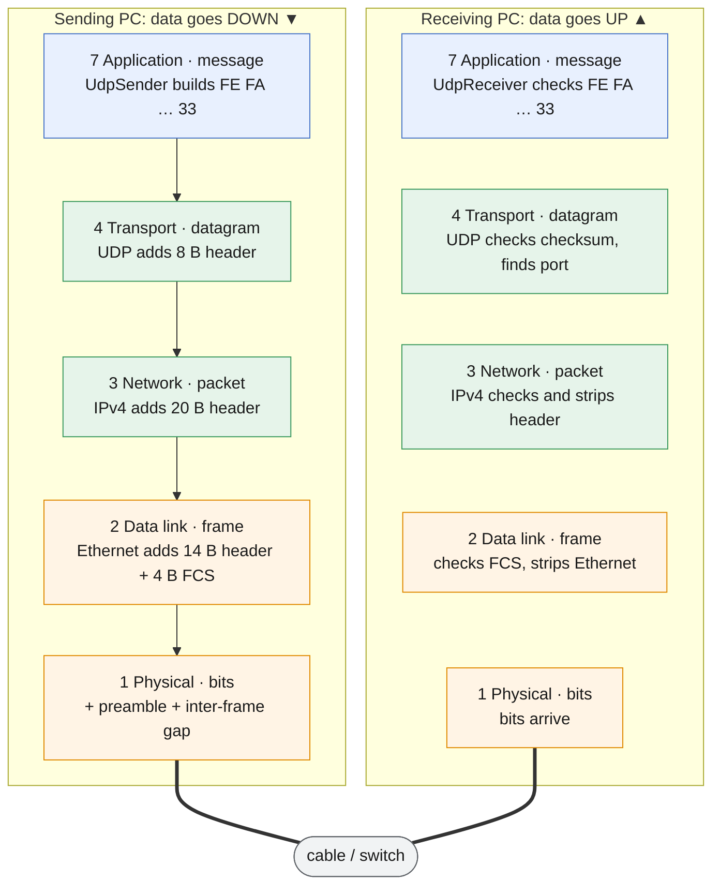
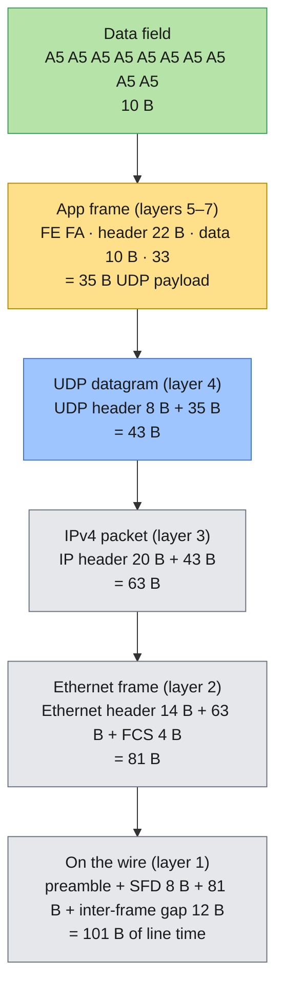
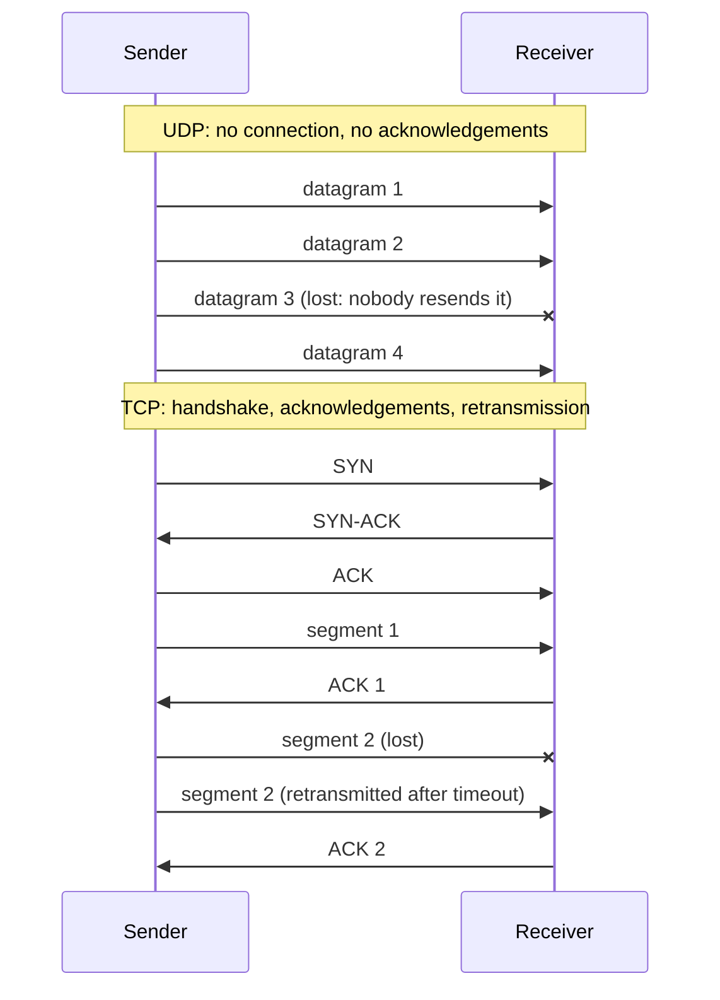
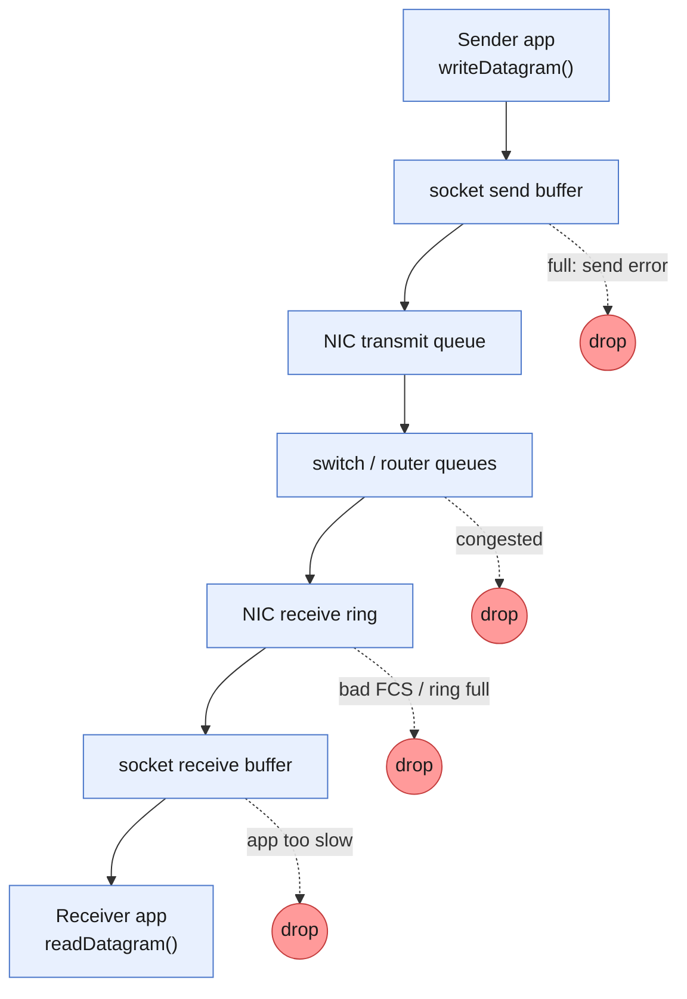
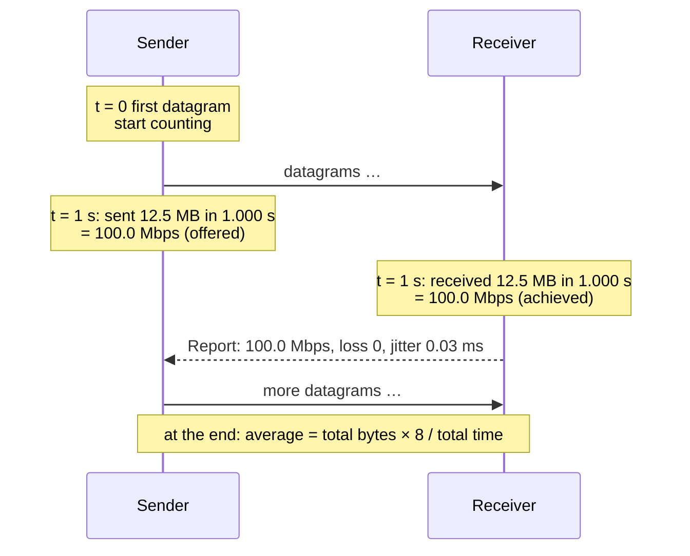
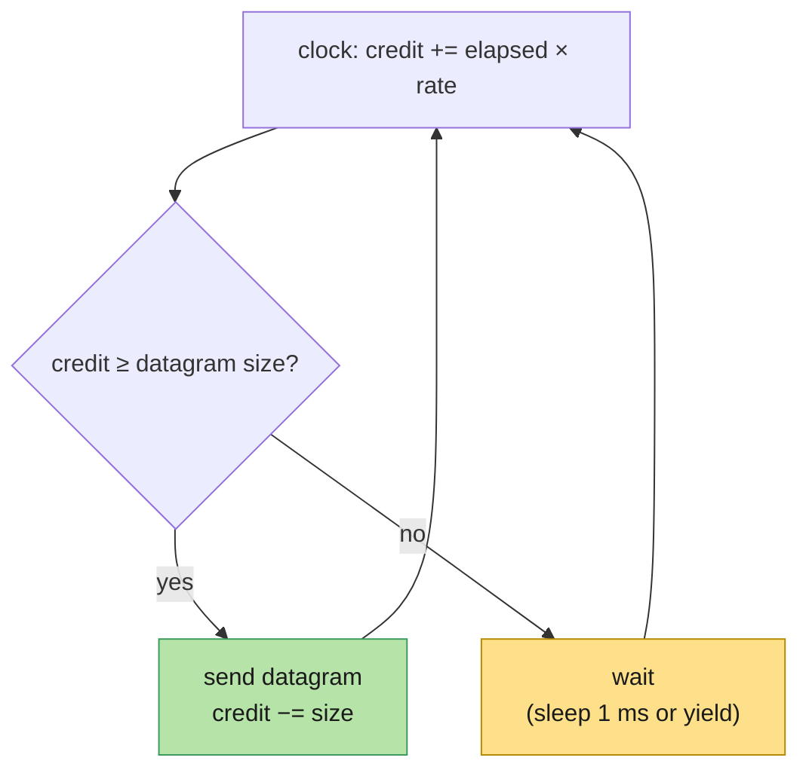
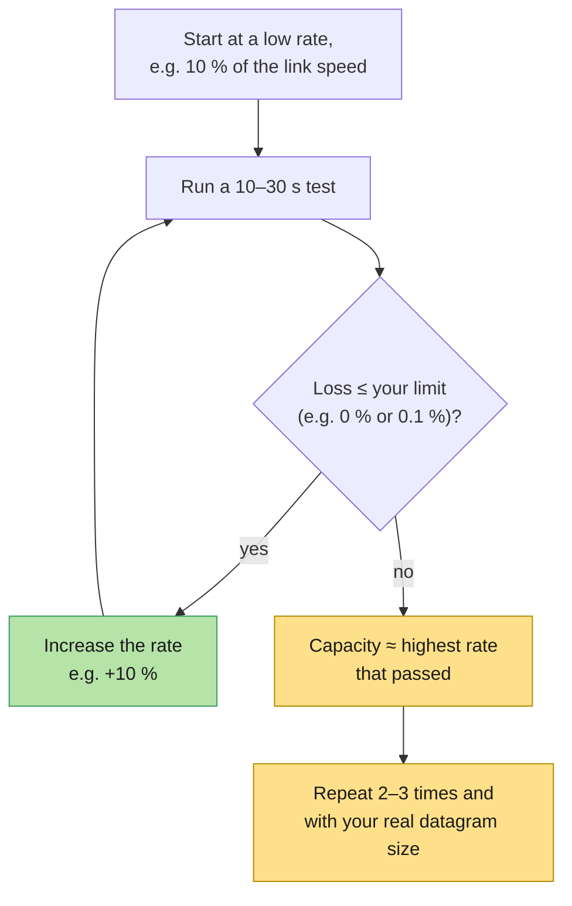

# 🌐 Networking Concepts: UDP, the OSI model and bandwidth measurement

This chapter explains the networking theory behind the UDP Bandwidth Tester: how data
travels through the layers of the OSI model, how UDP works, what can happen to UDP
datagrams on the way, and exactly how bandwidth, loss and jitter are measured. All
examples use the real numbers produced by this tool.

Contents

1. [The OSI model](#1-the-osi-model)
2. [Encapsulation: from your data to bits on the wire](#2-encapsulation-from-your-data-to-bits-on-the-wire)
3. [The network layer: IP, MTU and fragmentation](#3-the-network-layer-ip-mtu-and-fragmentation)
4. [How UDP works](#4-how-udp-works)
5. [What can happen to a UDP datagram](#5-what-can-happen-to-a-udp-datagram)
6. [Bandwidth, throughput and goodput](#6-bandwidth-throughput-and-goodput)
7. [How this tool measures bandwidth](#7-how-this-tool-measures-bandwidth)
8. [How loss, reordering and jitter are measured](#8-how-loss-reordering-and-jitter-are-measured)
9. [Finding the real capacity of a link](#9-finding-the-real-capacity-of-a-link)
10. [Quick reference](#10-quick-reference)

---

## 1. The OSI model

The **Open Systems Interconnection (OSI) model** splits network communication into seven
layers. Each layer offers a service to the layer above and uses the service of the layer
below. When sending, data passes *down* the layers and each layer adds its own header
(*encapsulation*). When receiving, it passes *up* and each layer removes its header
(*decapsulation*). Each layer only "talks" to the same layer on the other machine.

| # | Layer | Unit of data (PDU) | What it does | Typical examples | In this tool |
|---|---|---|---|---|---|
| 7 | **Application** | Data / message | Services for the user's program | HTTP, DNS, SNMP, **UDP Bandwidth Tester** | Test logic: send, receive, measure, report |
| 6 | **Presentation** | Data | Data format, encoding, encryption | TLS, JSON, byte order | Little-endian header fields; `FE FA` / `33` framing; data-field patterns |
| 5 | **Session** | Data | Opens, manages and closes dialogues | RPC, session IDs | Session ID; Start → Data → Stop → final Report handshake |
| 4 | **Transport** | Segment (TCP) / **datagram** (UDP) | End-to-end delivery between programs, identified by **ports** | **UDP**, TCP | UDP, port 5201 by default |
| 3 | **Network** | Packet | Addressing and routing between networks, identified by **IP addresses** | IPv4, IPv6, ICMP | IPv4 (or IPv6) |
| 2 | **Data link** | Frame | Delivery on one local link, identified by **MAC addresses**; error detection | Ethernet, Wi-Fi | Ethernet frame with CRC-32 FCS |
| 1 | **Physical** | Bits | Signals on the medium | Copper, fibre, radio | Line rate (100 Mbps, 1 Gbps, …), preamble, inter-frame gap |

The internet in practice uses the simpler **TCP/IP model**, which merges OSI layers 5–7
into one *application* layer and layers 1–2 into one *link* layer:

| TCP/IP model | OSI layers | Here |
|---|---|---|
| Application | 7, 6, 5 | UDP Bandwidth Tester (`src/core`) |
| Transport | 4 | UDP (operating system) |
| Internet | 3 | IPv4 (operating system) |
| Link | 2, 1 | Ethernet driver, network card, cable |

Only the top layer is code in this project. Everything from UDP downwards is provided by
the operating system and the network hardware. The app reaches it through a **socket**
(Qt's `QUdpSocket`).



Each layer only "talks" to the same layer on the other PC: the app's Start/Data/Stop/Report
messages, UDP datagrams, IP packets and Ethernet frames are each read and removed by the
matching layer on the receiving side.

---

## 2. Encapsulation: from your data to bits on the wire

Here is a single test datagram with a **10-byte data field** (`A5` × 10), followed down
through the layers:



| Layer | Adds | Running size | Added by |
|---|---|---|---|
| Your data | — | 10 B | you (data field) |
| App frame | `FE FA` (2) + header (22) + `33` (1) | 35 B | UDP Bandwidth Tester |
| UDP | 8-byte header | 43 B | operating system |
| IPv4 | 20-byte header | 63 B | operating system |
| Ethernet | 14-byte header + 4-byte FCS | 81 B | OS driver + network card |
| Physical | 8-byte preamble/SFD + 12-byte inter-frame gap | 101 B | network card |

Only **10 of those 101 bytes** are your data, an efficiency of **9.9 %**. With the default
1447-byte data field, the same calculation gives 1447 of 1538 bytes, or 94.1 %. Section 6
shows why this matters for bandwidth.

The receiver does the reverse: the network card checks the FCS and drops the frame if it
is corrupt; IP checks its header; UDP checks its checksum and delivers the payload to the
socket bound to the destination port; and the app checks `FE FA … 33` and the data field.

---

## 3. The network layer: IP, MTU and fragmentation

**IPv4** carries each UDP datagram in a packet with a 20-byte header. The fields that
matter for testing:

| Field | Meaning |
|---|---|
| Source / destination address | Which machines (e.g. `192.168.1.10` → `192.168.1.20`) |
| Protocol | `17` = UDP |
| Total length | Header + payload, max 65535 |
| TTL | Hop limit, decreased by each router |
| Identification, flags, fragment offset | Used when a packet must be **fragmented** |
| Header checksum | Protects the IP header only |

### MTU

Every link has a **Maximum Transmission Unit (MTU)**: the largest IP packet it can carry
in one frame. Standard Ethernet has an MTU of **1500 bytes**; "jumbo frame" networks use
**9000 bytes**.

```
largest UDP payload without fragmentation = MTU − 20 (IPv4) − 8 (UDP)
                                          = 1500 − 28 = 1472 bytes
largest data field in this tool           = 1472 − 25 (FE FA … 33) = 1447 bytes   (default)
with jumbo frames (MTU 9000)              = 8972-byte payload, 8947-byte data field
```

### Fragmentation

If a datagram is larger than the MTU allows, IP splits it into **fragments**, each with
its own IP header, and the receiver's IP layer reassembles them. UDP and the app never see
the fragments, but they matter for testing:

- If **any** fragment is lost, the **whole datagram** is lost. A 9000-byte datagram on a
  1500-MTU link becomes 7 fragments, so its loss probability is roughly 7× that of a
  single frame.
- Reassembly costs memory and CPU on the receiver, and some firewalls drop fragments.

So for bandwidth tests, keep datagrams within the MTU, which is the default here.

---

## 4. How UDP works

The **User Datagram Protocol** (RFC 768) is the simplest transport protocol. It adds
**port numbers** and a **checksum** to IP, and nothing else.

### 4.1 The UDP header (8 bytes)

```
 0                   15 16                  31   (bits)
+----------------------+----------------------+
|     Source port      |   Destination port   |
+----------------------+----------------------+
|        Length        |       Checksum       |
+----------------------+----------------------+
|              payload (data) ...             |
```

| Field | Size | Meaning | Example (10-byte data test) |
|---|---|---|---|
| Source port | 16 bit | Sender's port; the OS picks a free one ("ephemeral port") | `C7 95` = 51093 |
| Destination port | 16 bit | Port the receiver listens on | `14 51` = 5201 |
| Length | 16 bit | UDP header + payload, in bytes (8 to 65535) | `00 2B` = 43 |
| Checksum | 16 bit | Ones'-complement sum over a *pseudo-header* (source and destination IP, protocol 17, length), the UDP header and the payload | computed by the OS |

All fields are big-endian (network byte order). The Packet structure view and
`udpbw-cli --show-frame` show these bytes for every test.

### 4.2 Properties of UDP

| Property | UDP | Consequence for testing |
|---|---|---|
| **Connectionless** | No handshake; the first datagram is data | Nothing to set up; the app adds its own Start/Stop |
| **Unreliable** | No acknowledgements, no retransmission | Lost datagrams stay lost, so **loss can be measured** |
| **Unordered** | No sequence numbers | The app adds a sequence number to detect loss and reordering |
| **No flow or congestion control** | Sends as fast as the program asks | You choose the rate, so you can probe the link's real capacity |
| **Message-oriented** | One send = one datagram = one receive; boundaries are kept | Each datagram is one test unit (`FE FA … 33`) |
| **Checksum** | Detects corruption; bad datagrams are silently dropped | Corruption on the wire shows up as **loss**, not as bad data |
| **Small header** | 8 bytes (TCP: 20–60) | Low overhead; predictable sizes |
| **Max payload** | 65507 bytes over IPv4 (65535 − 20 − 8) | Upper limit of the datagram size |

### 4.3 UDP compared with TCP



| | UDP | TCP |
|---|---|---|
| Connection | none | 3-way handshake |
| Reliability | none | acknowledgements and retransmission |
| Ordering | none | guaranteed |
| Rate | as fast as the program sends | adapts (flow and congestion control) |
| Latency | lowest | higher (handshake, retransmissions, head-of-line blocking) |
| Typical uses | real-time data, telemetry, sensor and avionics data links, video and voice, DNS, NTP, gaming | web, file transfer, email |
| Testing a link with it | shows **raw** capacity, loss and jitter | shows what one TCP flow achieves; hides loss behind retransmissions |

That's why bandwidth testers such as this tool (and `iperf -u`) use UDP: you control the
rate exactly, and the network's loss and jitter are measured directly instead of being
hidden by TCP.

### 4.4 Sockets and ports

A program uses UDP through a **socket**:

1. **bind** the socket to a local address and port. The receiver binds `0.0.0.0:5201`, which
   means all interfaces, port 5201. The sender binds port 0, so the OS picks a free
   *ephemeral* port.
2. **send** a datagram to a destination address and port (`sendto`, Qt `writeDatagram`).
3. **receive** a datagram along with the sender's address and port (`recvfrom`, Qt
   `readDatagram`). The receiver uses that address and port to send its Report datagrams
   back.

Each socket has a **send buffer** and a **receive buffer** in the OS. This tool asks for
4 MiB and 8 MiB respectively. If the receiving program can't read fast enough, the
receive buffer fills up and the OS **drops** new datagrams. That is one of the most
common causes of UDP loss.

---

## 5. What can happen to a UDP datagram

UDP gives no guarantees, so between `writeDatagram()` and `readDatagram()` a datagram can be:

| Event | Where it happens | How the tool detects it |
|---|---|---|
| **Lost** | Full send buffer or NIC queue; congested switch port; corrupted frame (FCS or checksum fails → silently dropped); full receive buffer | Gap in sequence numbers → **loss** |
| **Reordered** | Multiple paths, link aggregation, Wi-Fi retries | Sequence number lower than one already seen → **out of order** |
| **Delayed unevenly** | Queues in switches, routers, OS scheduling | Variation of transit time → **jitter** |
| **Duplicated** | Rare (some link-layer retries, misconfigured networks) | Counted as received and as out of order (its sequence number was already seen); doesn't increase loss |
| **Corrupted but delivered** | Very rare: errors not caught by CRC/checksum, faulty middleboxes, application bugs | Data field ≠ reference → **data-field error** |
| **Not one of ours** | Other traffic to the port, truncated datagrams | Missing `FE FA` / `33` → **framing error** |



**Why does the tool validate the data field if UDP has a checksum?** Corruption on the
wire is almost always caught by the Ethernet CRC or the UDP checksum, and the datagram
is dropped, so it shows up as *loss*. The data-field check catches what those can't:
devices that rewrite payloads, bugs in the sending or receiving software, and memory or
DMA errors. It also lets you prove the whole chain works by injecting errors on purpose
(`Corrupt datagrams: 1 in N`).

---

## 6. Bandwidth, throughput and goodput

These terms are often mixed up:

| Term | Meaning | Example on 1 Gbps Ethernet, 1472-byte datagrams |
|---|---|---|
| **Bandwidth / line rate** | Raw capacity of the link at the physical layer | 1000 Mbps |
| **Throughput** | Rate actually achieved at a given layer | 957.1 Mbps of UDP payload |
| **Goodput** | Useful application data delivered per second (excludes all headers and lost data) | 940.8 Mbps of data field |
| **Packet rate (pps)** | Datagrams per second | 81,274 pps |
| **Utilisation** | Throughput ÷ capacity | 95.7 % at the UDP payload level |

### Units

- Network rates are in **bits per second**, with **decimal** prefixes: 1 Mbps = 1,000,000
  bit/s, 1 Gbps = 10⁹ bit/s.
- Sizes are in **bytes** (8 bits). Example: 100 MB in 8 s is `100,000,000 × 8 / 8 s` =
  100 Mbps.
- This tool reports throughput in bits per second and sizes in decimal MB, so rates and
  sizes always match.

### The overhead formula

For a data field of *d* bytes, each datagram uses:

```
UDP payload   p = d + 25                      (FE FA + header + 33)
IP packet       = p + 8 + 20                  (UDP + IPv4 headers)
Ethernet frame  = max(64, p + 8 + 20 + 18)    (header 14 + FCS 4; 64 B minimum frame)
line time    w  = frame + 20                  (preamble/SFD 8 + inter-frame gap 12)

max packets/s        = line rate / (w × 8)
max UDP payload rate = packets/s × p × 8      (what this tool reports)
max data rate        = packets/s × d × 8      (goodput)
efficiency           = d / w
```

### Effect of the datagram size on a 1 Gbps link

| Data field *d* | UDP payload | Ethernet frame | Line time *w* | Efficiency | Max packets/s | Max UDP payload rate | Max data rate |
|---|---|---|---|---|---|---|---|
| 1 B | 26 B | 72 B | 92 B | 1.1 % | 1,358,696 | 282.6 Mbps | 10.9 Mbps |
| 10 B | 35 B | 81 B | 101 B | 9.9 % | 1,237,624 | 346.5 Mbps | 99.0 Mbps |
| 64 B | 89 B | 135 B | 155 B | 41.3 % | 806,452 | 574.2 Mbps | 412.9 Mbps |
| 100 B | 125 B | 171 B | 191 B | 52.4 % | 654,450 | 654.5 Mbps | 523.6 Mbps |
| 512 B | 537 B | 583 B | 603 B | 84.9 % | 207,297 | 890.5 Mbps | 849.1 Mbps |
| **1447 B** (default) | **1472 B** | **1518 B** | **1538 B** | **94.1 %** | **81,274** | **957.1 Mbps** | **940.8 Mbps** |
| 8947 B (jumbo) | 8972 B | 9018 B | 9038 B | 99.0 % | 13,830 | 992.7 Mbps | 989.9 Mbps |

Two lessons from this table:

1. **Small datagrams waste the link.** At 10 data bytes, 90 % of the line time is headers
   and gaps.
2. **Small datagrams need huge packet rates.** Filling 1 Gbps with 35-byte datagrams takes
   1.24 million packets per second. A typical PC sends and receives only about 150,000 to
   250,000 UDP datagrams per second through the normal socket API. So with small
   datagrams, **the PC is the bottleneck, not the link**. In this project's own test, 10
   data bytes reached about 45 Mbps (≈160,000 pps) on a fast loopback.

| Link | 1472-B datagrams per second | Max UDP payload | Max data (1447 B) |
|---|---|---|---|
| 100 Mbps Ethernet | 8,127 | 95.7 Mbps | 94.1 Mbps |
| 1 Gbps Ethernet | 81,274 | 957.1 Mbps | 940.8 Mbps |
| 10 Gbps Ethernet | 812,744 | 9,570.9 Mbps | 9,408.3 Mbps |

So a "100 % clean" result on 1 Gbps Ethernet is about **957 Mbps** in this tool, not 1000,
because the rest of the line rate goes to the UDP, IP and Ethernet layers.

---

## 7. How this tool measures bandwidth

### 7.1 What is counted

The tool counts **UDP payload bytes**: the whole `FE FA … 33` frame, the bytes the
program hands to the socket and gets back from it. It can't see the bytes the OS and
network card add, so those are calculated, not measured (section 6 and the Packet
structure view).

### 7.2 Measuring over time

Both sides use a **monotonic clock** with nanosecond resolution (`QElapsedTimer`). It is
never adjusted by NTP or daylight saving, so time differences are always correct.

```
rate over an interval  =  bytes counted in the interval × 8  /  interval length (s)
average rate           =  total bytes × 8  /  time from first to last datagram (s)
```

- The **sender** counts the bytes `writeDatagram()` accepted: the *offered load*.
- The **receiver** counts the bytes `readDatagram()` returned: the *achieved
  throughput*. **This is the real bandwidth figure**; anything the network or the
  receiving PC couldn't carry is missing from it.
- Every second, the receiver sends its numbers back in a Report datagram, so the sender
  shows both sides together.



### 7.3 Controlling the offered rate: the token bucket

To send at exactly *R* Mbps, the sender uses a **token bucket**:

- Credit ("tokens", in bytes) accumulates continuously at `R × 10⁶ / 8` bytes per second.
- A datagram may be sent when the bucket holds at least one datagram's worth; sending
  spends that much credit.
- The bucket is capped at about 20 ms of credit, so after a pause the sender catches up
  with a short burst, never a long one.



This gives smooth, accurate rates: 200 Mbps requested gives 200.00 Mbps measured in this
project's tests. *Unlimited* mode skips the bucket and sends back to back, which measures
the most the sending PC can generate.

### 7.4 Accuracy notes

- **Interval edges:** datagrams sent at the end of one second may be counted at the
  start of the next on the receiver, so single intervals can read slightly above or below
  the target (for example 99.6 then 100.4 Mbps). The **average** is exact.
- **Buffering:** socket buffers can absorb a short burst, so a receiver interval can
  briefly exceed the link rate. Over a whole test, buffers don't change the average.
- **Loopback** (`127.0.0.1`) never touches a network card. It measures the PCs' and the
  OS's speed, not a link.

---

## 8. How loss, reordering and jitter are measured

### 8.1 Loss

Every data datagram carries a **sequence number** 0, 1, 2, …. The receiver tracks the
highest one seen, and the final Stop message says how many were sent in total:

```
expected = max(highest sequence number + 1, total announced in Stop)
lost     = expected − received
loss %   = lost / expected × 100
```

*Example:* the sender sends datagrams 0–999. The receiver gets 990 of them, the highest
being 999, and Stop says 1000 were sent. So expected = 1000, lost = 10, loss = 1.0 %.
Without the total from Stop, datagrams lost at the very end (after the last one received)
would go unnoticed.

### 8.2 Reordering

If a datagram arrives with a sequence number **lower** than one already received, it's
counted as **out of order**. A late datagram also fills the gap it left, which is why one
interval's loss can be negative: datagrams counted as lost in one second arrive in the
next.

### 8.3 Jitter (RFC 3550)

**Jitter** is how much the one-way delay varies from datagram to datagram. It's what
makes real-time data, voice and video stutter even when nothing is lost. The tool uses
the standard **RFC 3550** (RTP) formula:

```
transit(i) = arrival time(i) − send time(i)      (receiver clock − sender clock)
D(i)       = | transit(i) − transit(i−1) |
J(i)       = J(i−1) + ( D(i) − J(i−1) ) / 16
```

The two PCs' clocks are **not** synchronised, so `transit` includes an unknown offset.
But `D` is a *difference* of two transits, and the offset cancels out. That's why jitter
can be measured without synchronised clocks, while the one-way delay itself can't.

*Example* (transit times in ms; the constant clock offset doesn't matter):

| Datagram | Transit | D | J |
|---|---|---|---|
| 1 | 10.00 | — | 0 |
| 2 | 10.20 | 0.20 | 0.0125 |
| 3 | 9.90 | 0.30 | 0.0305 |
| 4 | 10.05 | 0.15 | 0.0379 |

The ÷16 makes J a smoothed running average that reacts gradually, so one late datagram
doesn't dominate.

---

## 9. Finding the real capacity of a link

The most useful UDP test is a **step test**: raise the rate until the network can't keep
up.



Tips:

- **Use the datagram size of your real traffic.** Capacity in Mbps depends heavily on
  datagram size (section 6).
- **Watch both ends.** If the sender reaches the target but the receiver doesn't, the
  difference is being lost in the network or the receiving PC. If the sender itself can't
  reach the target, the sending PC is the limit.
- **Check CPU load** during small-datagram tests; a busy receiver drops datagrams from its
  receive buffer.
- **Run longer tests** (minutes) to catch periodic problems such as other traffic or
  power-saving modes.
- **Test both directions:** swap the roles of the two PCs.

---

## 10. Quick reference

| Question | Answer |
|---|---|
| Header sizes | UDP 8 B · IPv4 20 B (IPv6 40 B) · Ethernet 14 B + FCS 4 B · preamble + gap 20 B · this app 25 B |
| Largest datagram without fragmentation | 1472 B UDP payload on a 1500-B MTU (1447-B data field in this tool) |
| Largest UDP payload | 65,507 B over IPv4 |
| Clean result on 1 Gbps Ethernet | ≈ 957 Mbps UDP payload with 1472-B datagrams |
| What corrupts the data field? | Rarely the wire (CRC/checksum drop those → loss); mostly devices or software. Use data-field validation |
| Why is my rate low with small datagrams? | Packets-per-second limit of the PCs, not the link |
| Why can interval loss be negative? | Late (reordered) datagrams fill gaps counted in the previous interval |
| Do the clocks need to be synchronised? | No: jitter uses differences of transit times |
