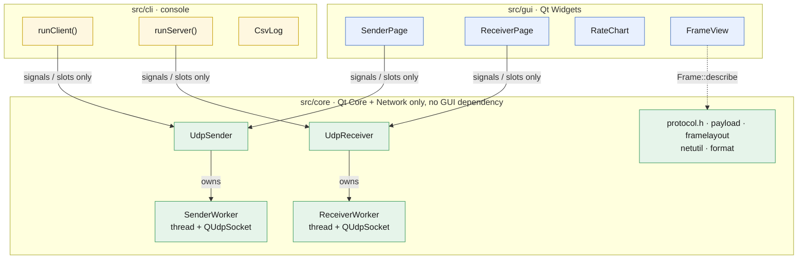
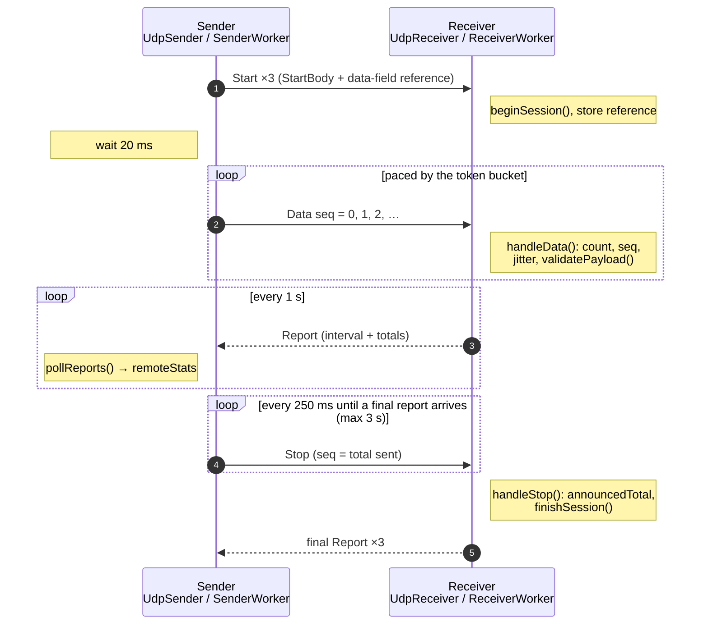
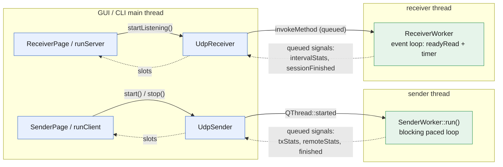

# Source Guide: UDP transmission, reception and monitoring

This guide explains how the UDP Bandwidth Tester works internally: how datagrams are
built and sent, how they are received and checked, and how packets and bandwidth are
measured and shown. For using the tools, see the [README](../README.md); for every function's parameters, see the
[API Reference](API_REFERENCE.md).

Contents

1. [Architecture](#1-architecture)
2. [Wire protocol](#2-wire-protocol)
3. [Transmission (sender)](#3-transmission-sender)
4. [Reception (receiver)](#4-reception-receiver)
5. [Monitoring packets and bandwidth](#5-monitoring-packets-and-bandwidth)
6. [Threading model](#6-threading-model)
7. [Using and extending the core](#7-using-and-extending-the-core)
8. [Performance limits and tuning](#8-performance-limits-and-tuning)

---

## 1. Architecture

The code is split into three layers. Only `core` touches the network.



| Layer | Folder | Depends on | Responsibility |
|---|---|---|---|
| Core | `src/core` | Qt Core, Qt Network | Framing, sending, receiving, validation, statistics, packet description |
| GUI | `src/gui` | core, Qt Widgets | Settings forms, charts, tables, packet structure view |
| CLI | `src/cli` | core | Command-line options, console output, CSV, exit codes |

The CMake target `udpbw_core` links only `Qt::Core` and `Qt::Network`, so any widget
include in `src/core` fails to build. That keeps the engine independent of the GUI. Both
front ends use only the public core API: `UdpSender`, `UdpReceiver`, `protocol.h`,
`payload.h`, `framelayout.h`, `netutil.h` and `format.h`.

### Core files

| File | Contents |
|---|---|
| `protocol.h` | Frame layout, header/body structs, `buildDatagram()`, `readHeader()`, report encode/decode, `TxStats` / `RxStats` |
| `senderworker.h/.cpp` | `SenderWorker`: the sending loop (pacing, error injection, stop handshake) |
| `receiverworker.h/.cpp` | `ReceiverWorker`: receive loop, session tracking, loss/jitter/validation, reports |
| `udpsender.h/.cpp` | `UdpSender`: public API; owns the sender thread and forwards signals |
| `udpreceiver.h/.cpp` | `UdpReceiver`: public API; owns the receiver thread and forwards signals |
| `payload.h/.cpp` | Data-field patterns (`Payload::build`), hex parsing, input validation |
| `framelayout.h/.cpp` | Field-by-field description of a datagram (`Frame::describe`, `Frame::toText`) |
| `netutil.h/.cpp` | `resolveHost()`, `localIPv4Addresses()` |
| `format.h/.cpp` | `formatRate()`, `formatBytes()` |

---

## 2. Wire protocol

### 2.1 Frame layout

Every datagram the app sends, in either direction, is one UDP payload with this layout.
All multi-byte fields are little-endian.

```
offset  0    1    2      3      4..7       8..15     16..23     24 .. n-2     n-1
      ┌────┬────┬──────┬──────┬──────────┬─────────┬──────────┬─────────────┬────┐
      │ FE │ FA │ type │ flags│ session  │  seq    │ sendNs   │ body / data │ 33 │
      └────┴────┴──────┴──────┴──────────┴─────────┴──────────┴─────────────┴────┘
       start bytes  \______________ Header: 24 bytes ______/                 stop byte
```

| Field | Size | Meaning |
|---|---|---|
| Start bytes | 2 | Always `FE FA` (`Proto::kStartByte0/1`) |
| type | 1 | `1` Data, `2` Start, `3` Stop, `4` Report (`Proto::Type`) |
| flags | 1 | Bit 0 = final report (`Proto::FinalReport`); otherwise 0 |
| session | 4 | Random, non-zero ID chosen by the sender for each test |
| seq | 8 | Data: datagram sequence number (0, 1, 2, ...). Stop: total datagrams sent |
| sendNs | 8 | Sender's monotonic clock in nanoseconds when the datagram was sent |
| body / data | n-25 | Depends on type (see below) |
| Stop byte | 1 | Always `33` (`Proto::kStopByte`) |

The framing overhead is `Proto::kFramingOverhead` = 25 bytes, so
`datagram size = data-field size + 25` (`Proto::packetSizeFor()`). The data field can be
1 to 65466 bytes (`kMinDataSize` … `kMaxDataSize`). The upper limit leaves room for the
Start datagram, which is 16 bytes larger and must fit the 65507-byte IPv4 UDP maximum.

Every datagram is built by `Proto::buildDatagram(type, session, seq, sendNs, body)`.
Every received datagram is checked by `Proto::hasValidFraming()`: length ≥ 25, first
bytes `FE FA`, last byte `33`. Datagrams that fail this check are never parsed further.

### 2.2 Message types

| Type | Direction | Body | Purpose |
|---|---|---|---|
| Start (2) | sender → receiver | `StartBody` (16 B) + reference copy of the data field | Opens a session; tells the receiver the datagram size, rate, duration and the exact data field to expect |
| Data (1) | sender → receiver | the data field | The measured traffic |
| Stop (3) | sender → receiver | none | Ends the session; `seq` = total data datagrams sent |
| Report (4) | receiver → sender | `ReportBody` (96 B) | Per-second statistics, plus a final report |

`StartBody`: `packetSize` (u32), `rateBps` (u64, 0 = unlimited), `durationMs` (u32).

`ReportBody`: totals (packets, bytes, lost, out-of-order, framing errors, data-field
errors), jitter, elapsed time, and the current interval (packets, bytes, lost, length).
It is encoded and decoded by `Proto::encodeReport()` and `Proto::decodeReport()`.

### 2.3 Session sequence



The Start and final Report are sent several times because UDP can drop them. The
receiver ignores duplicate Starts and answers repeated Stops by resending its last
final report.

---

## 3. Transmission (sender)

### 3.1 Entry point: `UdpSender`

`UdpSender::start(const SenderConfig &)` creates a `SenderWorker`, moves it to a new
`QThread`, connects the worker's signals to its own, and starts the thread. The thread's
`started()` signal runs `SenderWorker::run()`. `stop()` and `abort()` set a shared atomic
flag (`SenderControl`) that the loop checks on every iteration. When the worker emits
`finished()`, `UdpSender` joins the thread and emits its own `finished()`.

`SenderConfig` fields: `target`, `port`, `packetSize` (whole datagram), `rateMbps`,
`unlimited`, `durationSec`, `payload` (the data field, exactly `packetSize - 25` bytes),
`payloadDescription`, and `corruptEvery`.

### 3.2 `SenderWorker::run()` step by step

> 📈 Flow chart: [API Reference: SenderWorker](API_REFERENCE.md#senderworker-internal)

1. **Check the config.** The data field must match the datagram size. Otherwise it
   emits an error and finishes.
2. **Open the socket.** It binds a `QUdpSocket` to an ephemeral local port (`AnyIPv4`
   or `AnyIPv6` to match the target) and asks for a 4 MiB send buffer.
3. **Build the template.** `packet = buildDatagram(Data, session, 0, 0, payload)`. Only
   the header changes per datagram, so the data field and stop byte are written once.
4. **Announce.** It sends `Start` three times, then sleeps 20 ms so the receiver can
   reset.
5. **Send loop**, until the duration ends or a stop is requested. Each iteration:
   - computes whether a datagram may be sent (see 3.3);
   - overwrites the header in the template with `writeHeader(data, Data, session, seq, now)`;
   - applies error injection if configured (see 3.5);
   - calls `writeDatagram(data, packetSize, target, port)`;
   - on success, increments `seq` and the counters; for `seq == 0`, emits
     `sampleDatagram(bytes, localPort)` with the exact bytes sent;
   - every 5 ms, reads any Report datagrams (`pollReports()`), which emit `remoteStats`;
   - every 1 s, emits `txStats` for the interval (see 5.2).
6. **Final statistics.** It emits a trailing partial interval (if ≥ 200 ms), then
   `txStats` with `final = true` covering the whole data phase.
7. **Stop handshake.** It sends `Stop(seq = total sent)` every 250 ms and polls for the
   final report, for up to 3 s. If none arrives, it logs a firewall/address hint.
8. Emits `finished()`.

### 3.3 Rate control: token bucket

For a target rate *R* (Mbit/s) the sender earns credit at

```
bytesPerNs = R × 10^6 / 8 / 10^9
tokens     = min(burstBytes, tokens + (now − last) × bytesPerNs)
burstBytes = max(4 × packetSize, bytesPerNs × 20 ms)
```

A datagram is sent when `tokens ≥ packetSize`, and that many tokens are spent. The cap of
about 20 ms of credit means that if the thread gets descheduled, the sender catches up
with a short burst but never a huge one. Between datagrams the loop waits like this:

- more than 2 ms until the next datagram: `QThread::usleep(1000)`;
- otherwise: `QThread::yieldCurrentThread()`. This busy-waits, which gives precise
  pacing at the cost of one CPU core.

On Windows, `main()` calls `timeBeginPeriod(1)` so that 1 ms sleeps are really about 1 ms.
In **unlimited** mode the bucket is skipped and datagrams are sent back to back.

The rate counts UDP payload bytes, so `FE FA`, the header, the data field and `33` all
count, but IP and Ethernet headers do not (see 5.1).

### 3.4 Send errors

If `writeDatagram()` doesn't return the full size:

- `QAbstractSocket::TemporaryError` (socket buffer full): it's counted in `sendErrors`
  and retried with the same `seq`.
- Any other error: also counted, and the test aborts after 1000 such errors in a row.
- Each new error text is logged once.

### 3.5 Error injection (`corruptEvery`)

When `corruptEvery = N > 0`, every datagram with `seq % N == N − 1` has one data-field
byte inverted. The byte's position is `seq % dataSize`, so it moves around the field.
The byte is restored right after sending, so the template stays clean. The count goes
into `TxStats::corruptedPackets`. The receiver should report exactly that many data-field
errors, which verifies its validation end to end.

---

## 4. Reception (receiver)

### 4.1 Entry point: `UdpReceiver`

`UdpReceiver` creates one `ReceiverWorker` in its own thread for its whole lifetime.

- `startListening(addr, port, validate)` and `stopListening()` are forwarded to the
  worker's thread with `QMetaObject::invokeMethod(..., Qt::QueuedConnection)`.
- `shutdown()` stops listening synchronously (`BlockingQueuedConnection`), so a running
  test still sends its final report, and then ends the thread. The destructor calls it.

### 4.2 Socket setup: `ReceiverWorker::startListening()`

It binds `QUdpSocket` to `bindAddress:port`, requests an **8 MiB receive buffer** to
absorb bursts (and logs the size actually granted), connects `readyRead` to
`onReadyRead()`, and starts a 250 ms housekeeping timer (`onTick()`).

### 4.3 Receive loop: `onReadyRead()`

> 📈 Flow chart: [API Reference: ReceiverWorker](API_REFERENCE.md#receiverworker-internal)

```
while budget > 0 and datagrams are pending:
    n   = readDatagram(buf, 65536, &from, &fromPort)
    now = monotonic clock (ns)
    if !readHeader(buf, n)  → handleBadFrame()          (framing error)
    switch type: Data → handleData(); Start → handleStart(); Stop → handleStop()
    if a session is active and 1 s has passed → emitInterval(now)
if budget exhausted and more is pending → re-invoke onReadyRead() through the event loop
```

The budget (20,000 datagrams per call) keeps the timer and other events running even
under heavy load.

### 4.4 Sessions

| Situation | Action |
|---|---|
| `Start` with a new session ID | Finish any active session, then `beginSession()` (reset all counters) and store the data-field reference from the Start body |
| `Start` with the current or previous session ID | Ignored (duplicate) |
| `Data` with a new session ID (Start was lost) | Begin the session implicitly; data-field validation isn't possible without a reference |
| `Data` from the previous session | Ignored (stragglers) |
| `Data` after the session finished | Ignored (late) |
| `Stop` for the active session | Record `announcedTotal = seq`, then `finishSession()` |
| `Stop` after the session finished | Resend the final report (the sender missed it) |
| No datagrams for 5 s | `finishSession("timed out")` (from `onTick()`) |

### 4.5 Per-datagram processing: `handleData()`

For each valid Data datagram:

1. **Counters:** `packets++`, `bytes += n`, plus the same for the current interval.
2. **Sequence tracking:** if `seq > maxSeq`, then `maxSeq = seq`; otherwise
   `outOfOrder++`.
3. **Jitter** (RFC 3550, section 6.4.1):
   ```
   transit = arrivalNs − sendNs          (includes the unknown clock offset)
   D       = |transit − previousTransit| (the offset cancels out)
   J       = J + (D − J) / 16
   ```
   Because only differences of transit times are used, the two machines don't need
   synchronised clocks.
4. **Data-field validation** (if enabled and a reference exists):
   `validatePayload()` first checks the length. Then it compares the data field with the
   reference using `memcmp`, which is the fast path. On a mismatch it counts
   `payloadErrors` and logs the datagram number, how many bytes differ, the first
   differing offset, and the expected and actual bytes. Up to 10 errors are logged per
   session; the rest are only counted.
5. For the first datagram of a session it emits `sampleDatagram(bytes, srcPort, dstPort)`
   for the packet structure view.

### 4.6 Framing errors: `handleBadFrame()`

During an active session, any datagram without `FE FA … 33`, or shorter than 25 bytes,
increments `framingErrors`. The log shows its length, first two bytes and last byte.
Stray traffic between tests is ignored.

### 4.7 Reports to the sender

`emitInterval()` emits `intervalStats` locally and sends the same statistics to the
sender as a Report datagram (`sendReport(stats, 1)`). `finishSession()` sends the final
report three times. Reports go to the address and port the session's datagrams came
from, so they come back through the sender's own socket. The sender's firewall
therefore treats them as replies and lets them through.

---

## 5. Monitoring packets and bandwidth

### 5.1 What "bandwidth" means here

All rates count **UDP payload bytes**, which is the whole `FE FA … 33` frame:

```
Mbps = bytes × 8 / seconds / 10^6
```

The OS and network card add more on the link. `Frame::wireSize()` computes this per
datagram:

| Layer | Bytes |
|---|---|
| Data field (your data) | N |
| + `FE FA` + header + `33` | N + 25 = UDP payload |
| + UDP header | + 8 |
| + IPv4 header | + 20 |
| + Ethernet header + FCS | + 18 (minimum frame 64 B) |
| + preamble + inter-frame gap | + 20 = time on the link |

**Data efficiency** = N / (bytes on the link). For N = 1447 it is about 94 %; for N = 10
it is about 10 %. Small datagrams use most of the link for headers.

### 5.2 Sender statistics (`TxStats`)

Emitted once per second and once at the end (`final = true`):

| Field | Meaning |
|---|---|
| `intervalPackets`, `intervalBytes`, `intervalSec` | Sent in this interval. `intervalMbps()` = bytes × 8 / s / 10⁶ |
| `totalPackets`, `totalBytes`, `elapsedSec` | Since the first data datagram. `avgMbps()` |
| `sendErrors` | `writeDatagram` failures (see 3.4) |
| `corruptedPackets` | Datagrams deliberately corrupted (see 3.5) |

### 5.3 Receiver statistics (`RxStats`)

Built by `ReceiverWorker::snapshot()` and `emitInterval()`, and sent to the sender in
each Report:

| Field | Formula / meaning |
|---|---|
| `totalPackets`, `totalBytes` | Valid data datagrams received |
| expected | `max(maxSeq + 1, announcedTotal)`. `announcedTotal` comes from Stop, so datagrams lost at the very end are counted too |
| `totalLost` | `max(0, expected − totalPackets)` |
| `totalLossPct()` | `lost / (received + lost) × 100` |
| `intervalLost` | `(expected now − expected at interval start) − intervalPackets`. It can be **negative** when late datagrams fill gaps counted earlier; displays clamp it to 0 |
| `outOfOrder` | Datagrams that arrived after a higher sequence number |
| `jitterMs` | RFC 3550 interarrival jitter (see 4.5) |
| `framingErrors` | Datagrams without `FE FA … 33` |
| `payloadErrors` | Datagrams whose data field didn't match the reference |
| `elapsedSec` | From the first data datagram to now (to the last datagram for the final report) |
| `avgMbps()` | `totalBytes × 8 / elapsedSec / 10⁶` |

**Verdict:** PASS when `totalLost == 0 && payloadErrors == 0 && framingErrors == 0`;
otherwise FAIL. The CLI exits with code 3 on FAIL.

### 5.4 Where the numbers appear

| Place | Shows | Code |
|---|---|---|
| GUI Results boxes | Current and average rate, loss, jitter, data/framing errors, counts | `SenderPage::onTxStats/onRemoteStats`, `ReceiverPage::showTotals` |
| GUI Throughput tab | Per-second rate chart (sender: sent and received) | `RateChart`, fed by `txStats` / `intervalStats` / `remoteStats` |
| GUI table + Export CSV | One row per second | `appendTableRow`, `exportTableCsv` (`gui/common.cpp`) |
| GUI log | Session start/end, every logged error, PASS/FAIL | `log()` slots |
| GUI Packet structure tab | Layers, field table, hex dump, bytes on the wire | `FrameView` + `Frame::describe` |
| CLI | `TX` / `RX` lines per second, summary, verdict | `runClient`, `runServer` (`cli/main.cpp`) |
| CLI `--csv` | `side,time_s,mbps,datagrams,lost,loss_pct,jitter_ms,data_errors,framing_errors` | `CsvLog` |
| CLI `--show-frame` | Text version of the packet structure view | `Frame::toText` |

On the sender, the receiver's numbers arrive through Report datagrams, about 1 s
behind the sender's own numbers. So the sender's table shows the most recent receiver
report next to each sender interval.

### 5.5 Packet structure view

`Frame::describe(payload, srcPort, dstPort, preview)` returns a list of `Frame::Field`
entries: the four UDP header fields (big-endian; the checksum is shown as `?? ??`
because the OS computes it), then `FE FA`, type, flags, session, seq, sendNs, the data
field and `33`. Offsets count from the first byte of the UDP header.
`Frame::partAt(offset)` gives each byte's part for colouring. `FrameView` renders this as
HTML; `Frame::toText` renders it as text for the CLI.

---

## 6. Threading model



- **Sockets live only in worker threads.** The sender's socket is created inside
  `run()`; the receiver's inside `startListening()`. Each is used only by the thread
  that created it.
- **The sender loop doesn't use an event loop.** It polls the socket directly
  (`hasPendingDatagrams` / `readDatagram`) and checks an atomic flag to stop. This keeps
  pacing precise.
- **The receiver is event driven** (`readyRead` plus a 250 ms timer), with a read budget
  per wake-up.
- **Signal forwarding:** worker signals connect to `UdpSender`/`UdpReceiver` signals
  across threads, so Qt queues them. Slots therefore always run in the front end's
  thread, and the GUI never needs locks.
- **Ordering:** queued signals from one worker arrive in order. A test's final
  statistics always arrive before `finished()`.

---

## 7. Using and extending the core

### 7.1 Using the engine from other code

```cpp
#include "udpsender.h"
#include "payload.h"
#include "netutil.h"

UdpSender sender;
QObject::connect(&sender, &UdpSender::remoteStats, [](const RxStats &s) {
    qDebug() << s.intervalMbps() << "Mbps, lost" << s.totalLost;
});
QObject::connect(&sender, &UdpSender::finished, qApp, &QCoreApplication::quit);

SenderConfig cfg;
cfg.target = resolveHost("192.168.1.20");
cfg.port = 5201;
cfg.rateMbps = 50;
cfg.durationSec = 10;
PayloadConfig data{PayloadPattern::CustomHex, "DE AD BE EF"};
QString error;
if (!Payload::build(data, 100, cfg.payload, &error))   // 100 data bytes
    qFatal("%s", qPrintable(error));
cfg.packetSize = Proto::packetSizeFor(100);
sender.start(cfg);
```

A receiver works the same way with `UdpReceiver::startListening()` and its signals. Your
own program needs only `udpbw_core`, Qt Core and Qt Network.

### 7.2 Common changes

| Change | Where |
|---|---|
| Different start/stop bytes | `Proto::kStartByte0`, `kStartByte1`, `kStopByte` in `protocol.h`. Rebuild both ends |
| New data-field pattern | Add to `PayloadPattern` and `kAllPayloadPatterns`, then handle it in `Payload::build`, `patternName`, `patternKeyword` and `valueHint` (`payload.cpp`). The GUI and CLI pick it up automatically |
| New statistic | Compute it in `ReceiverWorker`, add it to `RxStats` and `ReportBody` (update the size `static_assert`), encode/decode it in `protocol.h`, then display it in the front ends |
| Different report interval | `kNsPerSec` comparisons in `ReceiverWorker::onReadyRead/onTick` and `SenderWorker::run` |
| Idle timeout | `kIdleTimeoutNs` in `receiverworker.cpp` |
| Socket buffer sizes | `kSendBufferBytes` (sender), `kRecvBufferBytes` (receiver) |

Any change to the wire format makes the build incompatible with older builds. Update
both machines.

---

## 8. Performance limits and tuning

- **Packets per second, not bits, limit small datagrams.** On a typical PC the sender
  manages roughly 150,000 to 250,000 datagrams per second. With a 10-byte data field
  (35-byte datagram) that is only about 45 Mbps, even on a fast link. Use larger data
  fields to measure link bandwidth.
- **MTU.** A 1447-byte data field gives a 1472-byte datagram, which fills a 1500-byte MTU
  without IP fragmentation. With jumbo frames (MTU 9000), use 8947. Larger datagrams are
  fragmented by IP: losing one fragment loses the whole datagram.
- **Receiver drops.** If loss appears on a fast link while the receiver's CPU is busy,
  the receiving host is likely the bottleneck. The receive buffer is 8 MiB; the log
  shows what the OS actually granted.
- **CPU.** The sender busy-waits for precise pacing (one core at 100 % during a test).
- **Firewall.** The receiver needs inbound UDP on the test port. Reports return through
  the sender's socket as replies.
